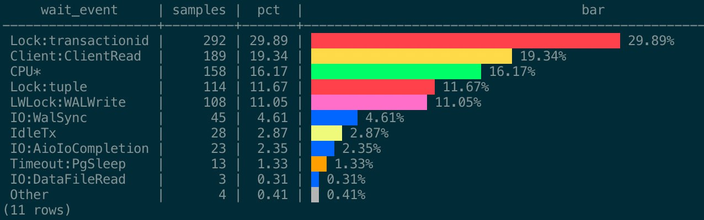
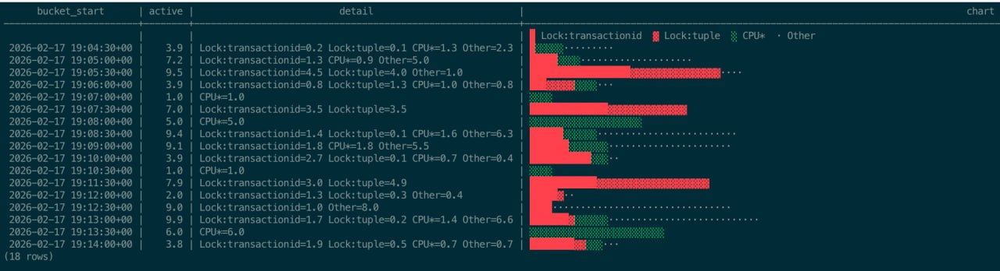

# pg_ash

[](https://github.com/NikolayS/pg_ash/actions/workflows/test.yml)
[](https://github.com/NikolayS/pg_ash)
[](https://github.com/NikolayS/pg_ash/blob/main/LICENSE)
[](https://github.com/NikolayS/pg_ash)
[-brightgreen)](https://github.com/NikolayS/pg_ash/actions/workflows/test.yml)

Active Session History for Postgres — lightweight wait event sampling with zero bloat.

> **Experimental.** Part of the [SAMO project](https://samo.sh/) — self-driving Postgres.

**The anti-extension.** Pure SQL + PL/pgSQL that works on any Postgres 14+ — including RDS, Cloud SQL, AlloyDB, Supabase, Neon, and every other managed provider. No C extension, no `shared_preload_libraries`, no provider approval, no restart. Just `\i` and go.

## Why

Postgres has no built-in session history. When something was slow an hour ago, there is nothing to look at. pg_ash samples `pg_stat_activity` every second and stores the results in a compact format queryable with plain SQL.

### How it compares

| | pg_ash | pg_wait_sampling | pgsentinel | External sampling |
|---|---|---|---|---|
| Install | `\i` (pure SQL) | shared_preload_libraries | shared_preload_libraries (Debian/Ubuntu: `apt install`, others: compile) | Separate infra |
| Works on managed (RDS, Cloud SQL, Supabase, ...) | Yes | Cloud SQL only (as of early 2026) | Not known to be supported | Yes, with effort |
| Sampling rate | 1s (via pg_cron) | 10ms (in-process) | 10ms (in-process) | 15-60s typical |
| Visibility | Inside Postgres | Inside Postgres | Inside Postgres | Outside only |
| Storage | Disk (~30 MiB/day) | Memory only | Memory only | External store |
| Historical queries | Yes (persistent) | Ring buffer (lost on restart) | Ring buffer (lost on restart) | Depends on setup |
| Pure SQL | Yes | No (C extension) | No (C extension) | No |
| Maintenance overhead | None | None | None | High |
| Requirements | pg_cron 1.5+ | shared_preload_libraries (restart required) | Compile + shared_preload_libraries (restart required) | Agent + storage |

## Quick start

```sql
-- install (just run the SQL file — works on RDS, Cloud SQL, AlloyDB, etc.)
\i sql/ash-install.sql

-- start sampling (1 sample/second via pg_cron)
select ash.start('1 second');

-- wait a few minutes, then query
select * from ash.top_waits('1 hour');
select * from ash.top_queries_with_text('1 hour');
select * from ash.top_by_type('1 hour');

-- stop sampling
select ash.stop();

-- uninstall (drops the ash schema and pg_cron jobs)
select ash.uninstall();
```

### Upgrade

```sql
-- from 1.0 to 1.1
\i sql/ash-1.1.sql

-- from 1.1 to 1.2
\i sql/ash-1.1-to-1.2.sql

-- check version
select * from ash.status();
```

## Function reference

### Relative time (last N hours)

| Function | Description |
|----------|-------------|
| `ash.top_waits(interval, limit, width)` | Top wait events ranked by sample count, with bar chart |
| `ash.top_queries(interval, limit)` | Top queries ranked by sample count |
| `ash.top_queries_with_text(interval, limit)` | Same as top_queries, with pg_stat_statements join |
| `ash.query_waits(query_id, interval, width, color)` | Wait profile for a specific query |
| `ash.top_by_type(interval, width, color)` | Breakdown by wait event type |
| `ash.wait_timeline(interval, bucket)` | Wait events bucketed over time |
| `ash.samples_by_database(interval)` | Per-database activity |
| `ash.activity_summary(interval)` | One-call overview: samples, peak backends, top waits, top queries |
| `ash.timeline_chart(interval, bucket, top, width)` | Stacked bar chart of wait events over time |
| `ash.samples(interval, limit)` | Fully decoded raw samples with timestamps and query text |
| `ash.status()` | Sampling status and partition info |

All interval-based functions default to `'1 hour'`. Limit defaults to `10` (top 9 + "Other" rollup row).

### Absolute time (incident investigation)

| Function | Description |
|----------|-------------|
| `ash.top_waits_at(start, end, limit, width)` | Top waits in a time range, with bar chart |
| `ash.top_queries_at(start, end, limit)` | Top queries in a time range |
| `ash.query_waits_at(query_id, start, end, width, color)` | Query wait profile in a time range |
| `ash.event_queries(event, interval, limit)` | Top queries for a specific wait event |
| `ash.event_queries_at(event, start, end, limit)` | Top queries for a wait event in a time range |
| `ash.samples_at(start, end, limit)` | Fully decoded raw samples in a time range |
| `ash.top_by_type_at(start, end, width, color)` | Breakdown by wait event type in a time range |
| `ash.wait_timeline_at(start, end, bucket)` | Wait timeline in a time range |
| `ash.timeline_chart_at(start, end, bucket, top, width)` | Stacked bar chart in a time range |

Start and end are `timestamptz`. Bucket defaults to `'1 minute'`.

## Usage

### Check status

```sql
select * from ash.status();
```

```
           metric           |             value
----------------------------+-------------------------------
 version                    | 1.2
 current_slot               | 0
 sample_interval            | 00:00:01
 rotation_period            | 1 day
 include_bg_workers         | false
 samples_in_current_slot    | 56
 last_sample_ts             | 2026-02-16 08:39:03+00
 wait_event_map_count       | 11
 wait_event_map_utilization | 0.03%
 query_map_count            | 8
 pg_cron_available          | no
```

### What hurt recently?

```sql
-- morning coffee: what happened overnight?
select * from ash.activity_summary('5 minutes');
```

```
        metric        |                                            value
----------------------+---------------------------------------------------------------------------------------------
 time_range           | 00:05:00
 total_samples        | 56
 avg_active_backends  | 6.6
 peak_active_backends | 10
 peak_time            | 2026-02-16 08:38:16+00
 databases_active     | 1
 top_wait_1           | Client:ClientRead (46.77%)
 top_wait_2           | Timeout:PgSleep (11.83%)
 top_wait_3           | Lock:transactionid (9.68%)
 top_query_1          | -2835399305386018931 — COMMIT (29.73%)
 top_query_2          | 3365820675399133794 — UPDATE pgbench_branches SET bbalance = bbalance + $1 WHERE b (23.24%)
 top_query_3          | -4378765880691287891 — UPDATE pgbench_tellers SET tbalance = tbalance + $1 WHERE t (11.35%)
```

```sql
-- top wait events (default: top 10 + Other)
select * from ash.top_waits('5 minutes');
```

```
     wait_event     | samples |  pct  |                  bar
--------------------+---------+-------+---------------------------------------
 Client:ClientRead  |     174 | 46.77 | ██████████████████████████████ 46.77%
 Timeout:PgSleep    |      44 | 11.83 | ████████ 11.83%
 Lock:transactionid |      36 |  9.68 | ██████ 9.68%
 CPU*               |      35 |  9.41 | ██████ 9.41%
 LWLock:WALWrite    |      31 |  8.33 | █████ 8.33%
 IdleTx             |      26 |  6.99 | ████ 6.99%
 IO:WalSync         |      19 |  5.11 | ███ 5.11%
 Lock:tuple         |       5 |  1.34 | █ 1.34%
 LWLock:LockManager |       2 |  0.54 | █ 0.54%
```

```sql
-- top queries with text from pg_stat_statements
select * from ash.top_queries_with_text('5 minutes', 5);
```

```
       query_id       | samples |  pct  | calls  | mean_time_ms |                             query_text
----------------------+---------+-------+--------+--------------+---------------------------------------------------------------------
 -2835399305386018931 |     110 | 29.73 | 283202 |         0.00 | commit
  3365820675399133794 |      86 | 23.24 | 283195 |         1.83 | UPDATE pgbench_branches SET bbalance = bbalance + $1 WHERE bid = $2
  5457019535816659310 |      44 | 11.89 |     11 |     17747.75 | select pg_sleep($1)
 -4378765880691287891 |      42 | 11.35 | 283195 |         0.40 | UPDATE pgbench_tellers SET tbalance = tbalance + $1 WHERE tid = $2
```

```sql
-- breakdown by wait event type
select * from ash.top_by_type('5 minutes');
```

```
 wait_event_type | samples |  pct  |                       bar
-----------------+---------+-------+-------------------------------------------------
 Client          |     174 | 46.77 | ████████████████████████████████████████ 46.77%
 Timeout         |      44 | 11.83 | ██████████ 11.83%
 Lock            |      41 | 11.02 | █████████ 11.02%
 CPU*            |      35 |  9.41 | ████████ 9.41%
 LWLock          |      33 |  8.87 | ████████ 8.87%
 IdleTx          |      26 |  6.99 | ██████ 6.99%
 IO              |      19 |  5.11 | ████ 5.11%
```

### Analyze a specific query

```sql
-- what is query 3365820675399133794 waiting on?
select * from ash.query_waits(3365820675399133794, '5 minutes');
```

```
     wait_event     | samples |  pct  |                       bar
--------------------+---------+-------+-------------------------------------------------
 Client:ClientRead  |      32 | 54.24 | ████████████████████████████████████████ 54.24%
 Lock:transactionid |      12 | 20.34 | ███████████████ 20.34%
 LWLock:WALWrite    |       6 | 10.17 | ████████ 10.17%
 CPU*               |       4 |  6.78 | █████ 6.78%
 IO:WalSync         |       3 |  5.08 | ████ 5.08%
 IdleTx             |       2 |  3.39 | ██ 3.39%
```

```sql
-- same, but during a specific time window
select * from ash.query_waits_at(3365820675399133794, '2026-02-16 08:38', '2026-02-16 08:40');
```

### Drill into a wait event

```sql
-- which queries are stuck on Lock:transactionid?
select * from ash.event_queries('Lock:transactionid', '1 hour');

-- or by wait type (matches all events of that type)
select * from ash.event_queries('IO', '1 hour');
```

### Browse raw samples

```sql
-- see the last 20 decoded samples with query text
select * from ash.samples('10 minutes', 20);
```

```
      sample_time       | database_name | active_backends |     wait_event     |       query_id       |                          query_text
------------------------+---------------+-----------------+--------------------+----------------------+--------------------------------------------------------------
 2026-02-16 11:18:51+00 | postgres      |               7 | CPU*               | -2835399305386018931 | END
 2026-02-16 11:18:51+00 | postgres      |               7 | CPU*               |  3365820675399133794 | UPDATE pgbench_branches SET bbalance = bbalance + $1 WHERE ...
 2026-02-16 11:18:49+00 | postgres      |               5 | Client:ClientRead  |  9144568883098003499 | SELECT abalance FROM pgbench_accounts WHERE aid = $1
 2026-02-16 11:18:49+00 | postgres      |               5 | IO:WalSync         | -2835399305386018931 | END
 2026-02-16 11:18:49+00 | postgres      |               3 | Lock:transactionid | -2835399305386018931 | END
 2026-02-16 11:18:49+00 | postgres      |               5 | LWLock:WALWrite    | -2835399305386018931 | END
```

```sql
-- raw samples during an incident
select * from ash.samples_at('2026-02-14 03:00', '2026-02-14 03:05', 50);
```

### Timeline chart

Visualize wait event patterns over time — spot spikes, correlate with deployments, see what changed.

```sql
select bucket_start, active, detail, chart
from ash.timeline_chart('5 minutes', '30 seconds', 3, 40);
```

```
      bucket_start       | active |                             detail                             |                           chart
-------------------------+--------+-----------------------------------------------------------------+-----------------------------------------------------------
                         |        |                                                                 | █ Client:ClientRead  ▓ LWLock:WALWrite  ░ IdleTx  · Other
 2026-02-16 08:37:30+00  |    2.0 | Other=2.0                                                      | ···········
 2026-02-16 08:38:00+00  |    7.0 | Client:ClientRead=2.3 LWLock:WALWrite=0.8 IdleTx=0.4 Other=3.5 | █████████████▓▓▓▓▓░░····················
 2026-02-16 08:38:30+00  |    6.6 | Client:ClientRead=4.0 LWLock:WALWrite=0.4 IdleTx=0.5 Other=1.7 | ███████████████████████▓▓░░░··········
 2026-02-16 08:39:00+00  |    5.3 | Client:ClientRead=3.3 LWLock:WALWrite=0.3 IdleTx=0.7 Other=1.0 | ███████████████████▓▓░░░░······
```

Each rank gets a distinct character — `█` (rank 1), `▓` (rank 2), `░` (rank 3), `▒` (rank 4+), `·` (Other) — so the breakdown is visible without color.

```sql
-- zoom into a specific time window
select * from ash.timeline_chart_at(
  now() - interval '10 minutes', now(),
  '1 minute', 3, 50
);
```

**Experimental: ANSI colors.** Enable per-session or per-call — green = CPU\*, blue = IO, red = Lock, pink = LWLock, cyan = IPC, yellow = Client, orange = Timeout, teal = BufferPin, purple = Activity, light purple = Extension, light yellow = IdleTx.

```sql
-- Option 1: enable once for the session (recommended)
set ash.color = on;

-- Option 2: per-call
select * from ash.top_waits('1 hour', p_color => true);
```

psql's table formatter escapes ANSI codes — to render colors, pipe through sed:

```sql
-- add to ~/.psqlrc for a reusable :color command
\set color '\\g | sed ''s/\\\\x1B/\\x1b/g'' | less -R'

-- then use it
select * from ash.top_waits('1 hour') :color
select * from ash.timeline_chart('1 hour') :color
```

Colors also render natively in pgcli, DataGrip, and other clients that pass raw bytes.

`top_waits` with colors:



`timeline_chart` with colors:



Example data generated with `pgbench -c 8 -T 65` on Postgres 17 with concurrent lock contention and idle-in-transaction sessions.

### Investigate an incident

Use the `_at` functions with absolute timestamps to zoom into a specific time window:

```sql
-- what happened between 3:00 and 3:10 am?
select * from ash.top_waits_at('2026-02-14 03:00', '2026-02-14 03:10');

-- which queries were running during the incident?
select * from ash.top_queries_at('2026-02-14 03:00', '2026-02-14 03:10');

-- minute-by-minute timeline of the incident
select * from ash.wait_timeline_at(
    '2026-02-14 03:00',
    '2026-02-14 03:10',
    '1 minute'
);
```

### LLM-assisted investigation

pg_ash functions chain naturally for how an LLM investigates a problem — each answer tells it what to ask next.

**Prompt:** *"There was a performance issue about 5 minutes ago. Investigate."*

Step 1 — the LLM checks the big picture:

```sql
select * from ash.activity_summary('10 minutes');
```

```
       metric        |  value
---------------------+---------
 samples             | 600
 avg_active_sessions | 4.2
 max_active_sessions | 12
 top_wait_event      | Lock:tuple
 top_query_id        | 7283901445
```

*"Average 4.2 active sessions but peak 12 — something spiked. And Lock:tuple is the top wait event."*

Step 2 — drill into the waits:

```sql
select * from ash.top_waits('10 minutes');
```

```
   wait_event   | samples | pct  |         bar
----------------+---------+------+---------------------
 Lock:tuple     |    2810 |  68% | ████████████████████
 CPU*           |     830 |  20% | ██████
 IO:DataFileRead|     290 |   7% | ██
 Client:ClientRe|     125 |   3% | █
 Other          |      83 |   2% |
```

*"Lock:tuple is 68% of all waits. Multiple sessions fighting over the same rows."*

Step 3 — see the timeline:

```sql
select * from ash.timeline_chart('10 minutes', '30 seconds', 5, 60);
```

```
      bucket_start       | active |                              chart                              |              detail
-------------------------+--------+-----------------------------------------------------------------+----------------------------------
                         |        | █ Lock:tuple  ▓ CPU*  ░ IO:DataFileRead  ▒ Client:ClientRead     |
 2026-02-17 14:00:00+00  |    2.1 | ▓▓▓▓░░···                                                      | CPU*=1.2 IO=0.5 Other=0.4
 2026-02-17 14:00:30+00  |    2.3 | ▓▓▓▓▓░░···                                                     | CPU*=1.4 IO=0.5 Other=0.4
 2026-02-17 14:01:00+00  |    3.8 | ██▓▓▓▓░░····                                                   | Lock=0.6 CPU*=1.5 IO=0.5 Other=1.2
 2026-02-17 14:01:30+00  |    8.5 | █████████████████▓▓▓░░···                                      | Lock=5.8 CPU*=1.3 IO=0.5 Other=0.9
 2026-02-17 14:02:00+00  |   12.0 | █████████████████████████████▓▓░░··                             | Lock=9.8 CPU*=1.1 IO=0.4 Other=0.7
 2026-02-17 14:02:30+00  |   11.2 | ███████████████████████████▓▓░░··                               | Lock=9.0 CPU*=1.0 IO=0.5 Other=0.7
 2026-02-17 14:03:00+00  |    4.1 | ███▓▓▓▓░░····                                                  | Lock=1.2 CPU*=1.5 IO=0.6 Other=0.8
 2026-02-17 14:03:30+00  |    2.0 | ▓▓▓▓░···                                                       | CPU*=1.1 IO=0.4 Other=0.5
 2026-02-17 14:04:00+00  |    2.2 | ▓▓▓▓░░···                                                      | CPU*=1.3 IO=0.5 Other=0.4
```

*"The spike is clearly 14:01:30 to 14:02:30 — Lock:tuple dominates. Let me find which queries."*

Step 4 — find the guilty queries:

```sql
select * from ash.event_queries_at(
  'Lock:tuple',
  '2026-02-17 14:01:30', '2026-02-17 14:02:30'
);
```

```
  query_id   | samples | pct  |         bar
-------------+---------+------+---------------------
  7283901445 |     412 |  85% | ████████████████████
  9102384756 |      53 |  11% | ███
  Other      |      19 |   4% | █
```

*"Query 7283901445 accounts for 85% of the lock waits."*

Step 5 — get the SQL text:

```sql
select * from ash.top_queries_with_text('10 minutes');
```

```
  query_id   | samples | pct  | mean_exec_time_ms | total_exec_time_ms |                    query_text
-------------+---------+------+-------------------+--------------------+--------------------------------------------------
  7283901445 |    2395 |  58% |            842.30 |          534120.50 | UPDATE orders SET status = $1 WHERE id = $2
  9102384756 |     530 |  13% |            215.60 |           42347.20 | UPDATE orders SET shipped_at = $1 WHERE id = $2
```

**LLM's conclusion:**

> Root cause: multiple concurrent `UPDATE orders ... WHERE id = $2` statements are contending
> on the same rows (`Lock:tuple`). Two different update patterns hit the `orders` table —
> status updates and shipping updates — and when they target overlapping rows, they serialize
> on tuple locks.
>
> Mitigation options:
> 1. Use `SELECT ... FOR UPDATE SKIP LOCKED` to skip already-locked rows and process them later
> 2. Batch the status and shipping updates into a single statement to reduce lock duration
> 3. If these run from a queue worker, reduce concurrency or partition the work by order ID range

## How it works

### Sampling

`ash.take_sample()` runs every second via pg_cron. It reads `pg_stat_activity`, groups active backends by `(wait_event_type, wait_event, state)`, and encodes the result into a single `integer[]` per database:

```
{-5, 3, 101, 102, 103, -1, 2, 104, 105, -8, 1, 106}
 │   │  │              │  │  │           │  │  │
 │   │  └─ query_ids   │  │  └─ qids     │  │  └─ qid
 │   └─ count=3        │  └─ count=2     │  └─ count=1
 └─ wait_event_id=5    └─ weid=1         └─ weid=8
```

6 active backends across 3 wait events = 1 row, 12 array elements. Each query_id is one backend — if two backends run the same query, the same map_id appears twice (the count reflects total backends, not distinct queries). Full row size: 24 (tuple header) + 4 (sample_ts) + 4 (datid) + 2 (active_count) + 2 (slot) + 68 (array: 20-byte header + 12 × 4) + alignment = **106 bytes** (measured with `pg_column_size`).

### Dictionary tables

| Table | Purpose |
|-------|---------|
| `ash.wait_event_map` | Maps `(state, wait_event_type, wait_event)` to integer IDs |
| `ash.query_map_0/1/2` | Maps `query_id` (from `pg_stat_activity`) to integer IDs (partitioned with samples) |

Dictionaries are auto-populated by the sampler. Wait events are stable (~600 entries max across all Postgres versions). Query map grows as new queries appear and is garbage-collected based on `last_seen`.

Encoding version is tracked in `ash.config.encoding_version`, not in the array itself — zero per-row overhead.

**Note on `CPU*`**: When `wait_event_type` and `wait_event` are both NULL in `pg_stat_activity`, the backend is active but not in a known wait state. This is *either* genuine CPU work *or* an uninstrumented code path where Postgres does not report a wait event. The asterisk signals this ambiguity. See [gaps.wait.events](https://gaps.wait.events) for details on uninstrumented wait events in Postgres — these gaps are being closed over time, making `CPU*` increasingly accurate.

### Rotation

Skytools PGQ-style 3-partition ring buffer. Three physical tables (`sample_0`, `sample_1`, `sample_2`) rotate daily. TRUNCATE replaces the oldest partition — zero dead tuples, zero bloat, no VACUUM needed for sample tables.

Only 2 partitions hold data at any time. The third is always empty, ready for the next rotation.

```
┌──────────┐  ┌───────────┐  ┌──────────┐
│ sample_0 │  │ sample_1  │  │ sample_2 │
│ (today)  │  │(yesterday)│  │ (empty)  │
│ writing  │  │ readable  │  │ next     │
└──────────┘  └───────────┘  └──────────┘
                              ↑ TRUNCATE + rotate
```

### Reader optimization

Reader functions decode arrays inline using `generate_subscripts()` with direct array subscript access. This avoids per-row plpgsql function calls and is 9-17x faster than the `CROSS JOIN LATERAL decode_sample()` approach.

## Storage

| Active backends | Storage/day | Max on disk (2 partitions) |
|----------------|------------|---------------------------|
| 10 | 11 MiB | 22 MiB |
| 50 | 30 MiB | 60 MiB |
| 100 | 50 MiB | 100 MiB |
| 200 | 100 MiB | 200 MiB |
| 500 | 245 MiB | 490 MiB |

At 500+ backends, TOAST LZ4 compression reduces actual storage.

## Performance

Measured on Postgres 17, 50 backends, 1s sampling, `jit = off` (median of 10 runs, warm cache):

| Metric | Result |
|--------|--------|
| `top_waits('1 hour')` | 30 ms |
| `top_waits('24 hours')` | 6.1 s |
| `top_queries_with_text('1 hour')` | 31 ms |
| `take_sample()` overhead | 53 ms |
| WAL per sample | ~29 KiB (~2.4 GiB/day) |
| Rotation (1-day partition) | 9 ms |
| Dead tuples after rotation | 0 |

See [issue #1](https://github.com/NikolayS/pg_ash/issues/1) for full benchmarks — EXPLAIN ANALYZE output, backend scaling, multi-database tests, WAL analysis, and concurrency testing.

## Requirements

- Postgres 14+ (requires `query_id` in `pg_stat_activity`)
- pg_cron 1.5+ (for sub-minute scheduling)
- pg_stat_statements (optional — enables query text, `calls`, `total_exec_time_ms`, `mean_exec_time_ms` in `top_queries_with_text()` and `event_queries()`; all other functions work without it)

**Note on `query_id`**: The default `compute_query_id = auto` only populates `query_id` when pg_stat_statements is in `shared_preload_libraries`. If `query_id` is NULL in `pg_stat_activity`, set:

```sql
alter system set compute_query_id = 'on';
-- requires reload: select pg_reload_conf();
```

## Configuration

```sql
-- change sampling interval (default: 1 second)
select ash.stop();
select ash.start('5 seconds');

-- change rotation interval (default: 1 day)
update ash.config set rotation_period = '12 hours';

-- check current configuration
select * from ash.status();
```

### pg_cron run history

pg_cron logs every job execution to `cron.job_run_details`. At 1-second sampling, this adds ~12 MiB/day of unbounded growth. pg_cron has no built-in purge — two options:

**Option 1: Disable logging entirely** (recommended if you don't need pg_cron troubleshooting):

```sql
alter system set cron.log_run = off;
select pg_reload_conf();
```

**Option 2: Schedule periodic cleanup** (keeps recent history for debugging):

```sql
select cron.schedule(
  'ash_purge_cron_log',
  '0 * * * *',
  $$delete from cron.job_run_details where end_time < now() - interval '1 day'$$
);
```

`ash.start()` will warn about this overhead.

## Known limitations

- **Primary only** — pg_ash requires writes (`INSERT` into sample tables, `TRUNCATE` on rotation) and pg_cron, so it cannot run on physical standbys or read replicas. Install it on the primary; it samples all databases from there.
- **Observer-effect protection** — the sampler pg_cron command includes `SET statement_timeout = '500ms'` to prevent `take_sample()` from becoming a problem on overloaded servers. If `pg_stat_activity` is slow (thousands of backends), the sample is canceled rather than piling up. Normal execution is ~50ms — the 500ms cap gives 10× headroom. Adjust in `cron.job` if needed.
- **Sampling gaps under heavy load** — pg_cron runs in a single background worker and under heavy load (lock storms, many concurrent sessions) it can't always keep up with the 1-second schedule. You may see gaps of 8s, 13s, or even 30s+ between samples — ironically during the most interesting moments. This is a fundamental pg_cron limitation, not a bug. If precise 1-second sampling matters, use an external sampler (e.g., a shell loop: `while true; do psql -c "select ash.take_sample()"; sleep 1; done`) which is more reliable under load.
- **24-hour queries are slow** (~6s for full-day scan) — aggregate rollup tables are [planned](blueprints/ROLLUP_DESIGN.md).
- **JIT protection built in** — all reader functions use `SET jit = off` to prevent JIT compilation overhead (which can be 10-750x slower depending on Postgres version and dataset size). No global configuration needed.
- **Single-database install** — pg_ash installs in one database and samples all databases from there. Per-database filtering works via the `datid` column.
- **query_map hard cap at 50k entries** — on Postgres 14-15, volatile SQL comments (e.g., `marginalia`, `sqlcommenter` with session IDs or timestamps) produce unique `query_id` values that are not normalized. This can flood the query_map partitions. A hard cap of 50,000 entries per partition prevents unbounded growth — queries beyond the cap are tracked as "unknown." PG16+ normalizes comments, so this is rarely hit. Check `query_map_count` in `ash.status()` to monitor.
- **Parallel query workers counted individually** — parallel workers share the same `query_id` as the leader but are counted as separate backends. This inflates the apparent "weight" of parallel queries in `top_queries()`. Track `leader_pid` grouping is a potential future improvement.
- **WAL overhead** — 1-second sampling generates ~29 KiB WAL per sample (~2.4 GiB/day), dominated by `full_page_writes`. This is significant for WAL-sensitive replication setups. Consider 5-second or 10-second sampling intervals (`ash.start('5 seconds')`) if WAL volume is a concern. The overhead scales linearly with sampling frequency.

## License

[Apache 2.0](LICENSE)
