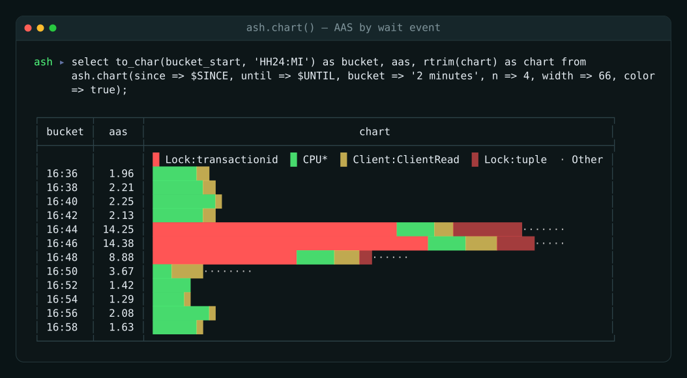
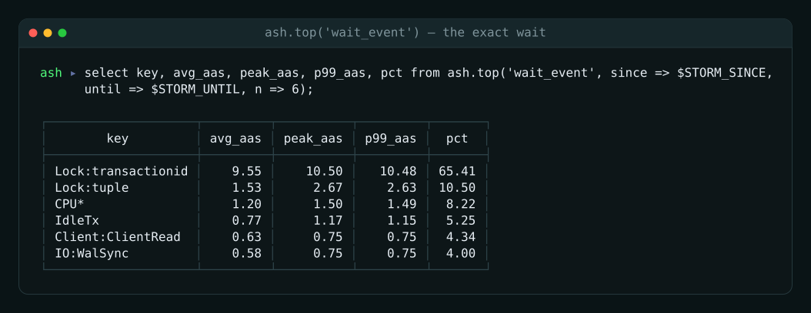
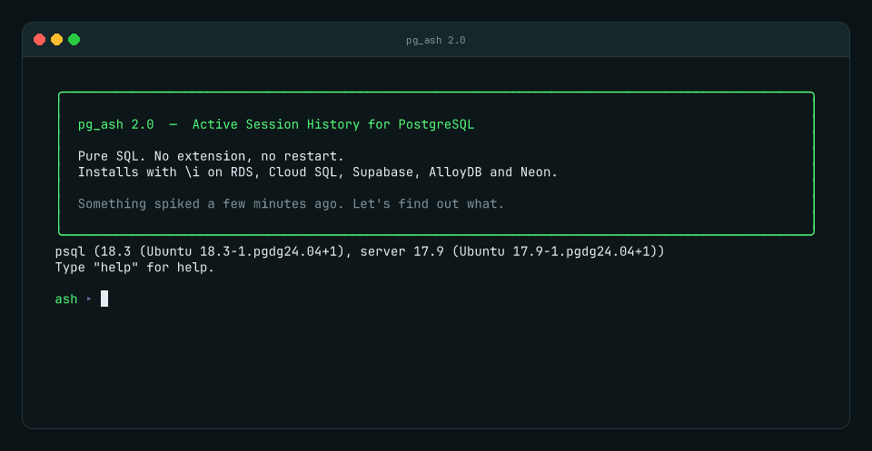

# pg_ash: Active Session History for Postgres

[](https://github.com/NikolayS/pg_ash/actions/workflows/test.yml)
[](https://github.com/NikolayS/pg_ash)
[](LICENSE)
[](https://github.com/NikolayS/pg_ash)

pg_ash is Active Session History (ASH) for Postgres, implemented in plain SQL and PL/pgSQL.

pg_ash samples `pg_stat_activity`, stores compact wait-event history in the
database, and lets you answer "what was happening then?" after the problem is
gone. It works on managed Postgres because it is not a C extension: no
`shared_preload_libraries` entry or restart for pg_ash itself. The installing
role still needs permission to create the schema; cross-role statistics and
optional extensions have separate [privilege requirements](#privileges).

## Why pg_ash

Postgres has excellent current-state views, but almost no built-in memory. If a
lock storm ended ten minutes ago, `pg_stat_activity` cannot tell you who waited,
when it peaked, or which query carried the load. pg_ash keeps that history
inside Postgres and exposes it as AAS: average active sessions.

Use pg_ash when you need:

- incident reconstruction after the spike is gone
- wait-event timelines without external agents
- query IDs from `pg_stat_activity`, with optional SQL text through
  `pg_stat_statements`
- long-term AAS trends through rollups
- a tool that can run on RDS, Cloud SQL, AlloyDB, Supabase, Neon, and similar
  managed platforms

## Quick start

The current `main` branch contains the frozen 2.0 beta 1 SQL in `sql/`.
Changes under `devel/sql/` are the development candidate, not a published
release. See [the release process](docs/RELEASE_PROCESS.md).

Neither pg_cron nor pg_stat_statements is required. The example below uses
pg_cron if available; otherwise configure [external scheduling](#scheduling).

```sql
\i sql/ash-install.sql

select ash.start('1 second');

select * from ash.periods();
select * from ash.top('wait_event_type');
select * from ash.top('query_id');
select * from ash.chart(since => now() - interval '5 minutes', color => true);
```

## Color output

`ash.chart()` can render its AAS timeline with ANSI colors when `color => true`
or `set ash.color = on` is used:

```sql
select *
from ash.chart(
  since => now() - interval '1 hour',
  until => now(),
  color => true
);
```



`ash.chart()` — Average Active Sessions per minute, stacked by wait event, in
24-bit color straight out of `psql`. The glyph varies per series (`█ ▓ ░ ▒ ·`)
as well as the color, so the ranking still reads correctly for colorblind
viewers and in a monochrome terminal.



`ash.top('wait_event')` — the wait-event breakdown for the incident window,
ranked by Average Active Sessions, with the share of total active time. When
`Lock:transactionid` dominates, sessions are waiting for other transactions to
finish. Investigate transaction scope and blockers; this does not rule out
other capacity constraints.



Every image above is real `ash.*` output over real samples, regenerated with
`make -C demos all`. See [demos/README.md](demos/README.md).

For the latest stable v1.5 tag, check out `v1.5` first and use:

```sql
\i sql/ash-install.sql
```

## Upgrade to 2.0

2.0 is a breaking reader-API release. Upgrade scripts are cumulative; run the
missing scripts in order.

```sql
\i sql/migrations/ash-1.0-to-1.1.sql
\i sql/migrations/ash-1.1-to-1.2.sql
\i sql/migrations/ash-1.2-to-1.3.sql
\i sql/migrations/ash-1.3-to-1.4.sql
\i sql/migrations/ash-1.4-to-1.5.sql
\i sql/migrations/ash-1.5-to-2.0.sql

select * from ash.status() where metric = 'version';
-- version | 2.0-beta1
```

The old root-level upgrade paths, such as `sql/ash-1.5-to-2.0.sql`, are kept as
compatibility wrappers. New docs and scripts should use `sql/migrations/`.

The old 1.x reader functions are gone in 2.0:

| 1.x | 2.0 |
|---|---|
| `top_waits`, `top_by_type` | `top('wait_event')`, `top('wait_event_type')` |
| `top_queries`, `top_queries_with_text` | `top('query_id')` |
| `wait_timeline` | `timeline(...)` |
| `timeline_chart` | `chart(...)` |
| `activity_summary` | `summary(...)` |
| `query_waits(q)` | `top('wait_event', query_id => q)` |
| `event_queries(e)` | `top('query_id', wait_event => e)` |
| `samples_by_database` | `top('database')` |

Full mapping: [`blueprints/AAS_EXAMPLES.md`](blueprints/AAS_EXAMPLES.md).

## Reader API

Start with `ash.periods()`, then drill down with `ash.timeline()` and `ash.top()`.
Typed aggregate readers report `raw`, `rollup_1m`, `rollup_1h`,
`rollup_1h_flat`, or `none`; `ash.compare()` reports `source_1` / `source_2`,
`ash.report()` embeds provenance in JSON coverage, and `ash.summary()` includes
separate headline and wait/query drill source/bounds metrics. `ash.samples()`
is raw-only, and `ash.chart()` emits a planning `NOTICE` when hour grain widens
the request. `rollup_1h_flat` means a
minute-capable plan encountered legacy/incomplete detail and degraded honestly
to hour grain.

| Function | Use it for |
|---|---|
| `ash.periods([until])` | Standard trailing windows: 1m, 5m, 1h, 1d, 1w, 1mo |
| `ash.aas(since, until, filters..., [bucket])` | Scalar AAS for one window |
| `ash.timeline(since, until, [bucket], filters...)` | AAS time series |
| `ash.top(dimension, since, until, filters..., [n], [bucket], [order_by])` | Top waits, queries, databases, or wait classes |
| `ash.compare(since_1, until_1, since_2, until_2, [dimension], filters...)` | Before/after diff |
| `ash.samples(since, until, [n], filters...)` | Decoded raw samples |
| `ash.report(since, until, [vcpus], [n])` | Machine-readable JSON report |
| `ash.chart(since, until, [bucket], [n], [width], [color])` | Human ASCII AAS chart |
| `ash.summary(since, until)` | Human key/value summary |

Filters are consistent where they apply:

- `wait_event_type => 'IO'`
- `wait_event => 'IO:DataFileRead'`
- `query_id => 8231004856741017`
- `database => 'appdb'`

`ash.top()` dimensions are:

- `wait_event_type`
- `wait_event`
- `query_id`
- `database`

`order_by` is `avg`, `peak`, or `p99`. During incidents, `order_by => 'peak'`
is usually the right first cut because it surfaces short spikes that averages
hide. When retained grain is coarser than the requested bucket, peak/p99 are
NULL instead of being filled with an hour average. Hour-only partial-window
drills snap outward and disclose effective bounds/bucket; plain
`top('database')` keeps minute precision through per-database `minute_counts`.

<a id="investigation-flow"></a>

## LLM-assisted investigation

**Prompt:** "There was a performance issue about five minutes ago. Investigate."

An LLM can follow the same five-step investigation as an operator: inspect
load, find waits, locate the spike, identify affected queries, then inspect
raw evidence. The [executable psql example](examples/llm-investigation.sql)
runs these steps in a read-only transaction and chooses the drill window from
the results. The snippets below show each step; the script supplies the
variables from actual results. It needs an existing installation with recent activity:

```bash
psql -X -v ON_ERROR_STOP=1 -d mydb -f examples/llm-investigation.sql
```

For an older incident, pass explicit bounds, including the time zone:

```bash
psql -X -v ON_ERROR_STOP=1 -d mydb \
  -v since='2026-09-04T14:00:00+00' -v until='2026-09-04T14:10:00+00' \
  -f examples/llm-investigation.sql
```

### 1. Check the big picture

Freeze the window once so later queries answer the same question. In psql:

```sql
select now() - interval '10 minutes' as since, now() as until \gset
select * from ash.aas(since => :'since', until => :'until');
```

Read average and peak AAS together with `source`, `effective_bucket`, and
`buckets_with_data`. A peak above the average suggests concentrated load; it
does not by itself establish an incident. Observation counts cannot distinguish
idle sampling from a scheduler outage. Check scheduler health separately.

### 2. Find the dominant waits

```sql
select * from ash.top(
  'wait_event', since => :'since', until => :'until',
  order_by => 'peak', n => 5
);
```

If `Lock:transactionid` leads, sessions were waiting for transactions. If
`CPU*` leads, sessions were active with no reported wait: CPU execution and
uninstrumented paths are both possible. The example chooses a wait from this
output; a query waiting on a lock is not necessarily the blocker.

### 3. Locate the spike

```sql
select * from ash.timeline(
  since => :'since', until => :'until',
  bucket => '1 minute', wait_event => :'wait_event'
);
```

Here `wait_event` is the event selected in step 2. Use the busiest observed
bucket as `spike_since` and its exclusive end as `spike_until`. The script
checks the effective resolution before proceeding. A retained hour aggregate
cannot establish the timing of a one-minute spike.

### 4. Identify the queries experiencing the wait

```sql
select * from ash.top(
  'query_id', since => :'spike_since', until => :'spike_until',
  wait_event => :'wait_event', order_by => 'peak', n => 5
);
```

`query_text` is included when pg_stat_statements can resolve it. Query IDs
still work without that extension. Select a non-NULL query ID from the output;
if none is available, report unattributed load rather than inventing SQL.

Every explicit `query_id` filter and every query breakdown with a wait filter
needs the raw wait-to-query link. If older rollup history covers the requested
pre-raw interval, pg_ash raises with the retention boundary. Unfiltered
`ash.top('query_id')` can use compacted rollups, where a NULL key accounts for
unpreserved attribution and participates in the top `n` rows.

### 5. Inspect the raw evidence

```sql
select * from ash.samples(
  since => :'spike_since', until => :'spike_until',
  query_id => :query_id, n => 20
);
select * from ash.top(
  'wait_event', since => :'spike_since', until => :'spike_until',
  query_id => :query_id
);
```

A supported conclusion is: "Query X experienced transaction-lock waits during
this window; inspect its transaction scope and the blocking transaction."
Stored samples do not identify the blocker, conflicting row values, or the
order of subsecond events. Confirm those separately before changing the
application. `SKIP LOCKED`, for example, changes which rows an operation
processes and is not a general lock-contention remedy.

In the [captured run](examples/README.md), 28 backend-seconds produced 0.23
average AAS over two minutes and a 0.47 peak minute. One update accounted for
all 14 tuple-lock backend-seconds. The next step was to inspect its blocking
transaction, not infer one from the waiting query ID. Give a model the [provider-neutral analysis prompt](examples/llm-prompt.md)
alongside that evidence or an `ash.report()` payload. pg_ash makes no calls to
an LLM service. Review SQL text before sharing it outside your environment.

## Chart rendering

`ash.chart()` is for humans. `ash.timeline()` is the typed-data companion.

```sql
select bucket_start, aas, detail, chart
from ash.chart(
  since => now() - interval '5 minutes',
  bucket => '1 minute',
  n => 4,
  width => 50
);
```

Enable ANSI color per call:

```sql
select *
from ash.chart(
  since => now() - interval '1 hour',
  color => true
);
```

psql's aligned formatter escapes ANSI bytes. Add this to `.psqlrc` for colored
terminal output:

```sql
\set color '\\g | sed ''s/\\\\x1B/\\x1b/g'' | less -R'
```

Then run:

```sql
select * from ash.chart(since => now() - interval '1 hour', color => true) :color
```

## Machine report

`ash.report()` returns one JSONB payload for monitoring and incident analysis:

```sql
select ash.report(
  since => now() - interval '1 day',
  vcpus => 16
);
```

| Field | Meaning |
|---|---|
| `aas_avg`, `aas_worst1m`, `aas_p99`, `aas_p999` | Average, maximum, and percentiles of the one-minute series over activity-bearing rollup minutes |
| `cpu`, `io`, `ipc`, `lock`, `lwlock` | CPU*, IO, IPC, Lock, and LWLock classes respectively; CPU* is not measured CPU utilization |
| `total` in each AAS object | The sum of those five classes in each minute; other captured classes are excluded |
| `top_events_*` | Events for each non-CPU class's own extreme minute or percentile-minute set; parenthesized AAS rounds to one decimal |
| `top_queryids_*` | Query IDs for raw-covered extreme minutes, with optional class keys; these objects do not contain SQL text |
| `top_queryids_available` | Whether at least one extreme-minute attribution key is available; independent of pg_stat_statements |
| `coverage` | Effective `from`, `to`, `source`, `minutes_expected`, `minutes_with_data`, and `raw_retention_start` |
| `vcpus` | Optional caller-supplied core count, echoed unchanged; no scoring is performed |

Class maxima can occur at different times. They are not a decomposition of the
total peak and must not be added together. Parenthesized event/query AAS
rounds to one decimal and need not match or sum to class AAS rounded to two
decimals. Use a timeline and a common drill
window to compare classes at the same time. AAS divided by vCPUs is a load
ratio, not CPU utilization or an automatic health verdict; lock contention can
hurt a workload even at low ratios.

`minutes_with_data` counts activity-bearing rollup minutes, not sampler
heartbeats. Missing observations can mean idle activity, missed sampling, or
expired history; verify scheduler evidence separately. The report's averages
and percentiles use those stored minutes, so they need not equal a full-window
`ash.aas()` result. `raw_retention_start` is a logical planning boundary;
physical raw availability determines whether extreme minutes can be attributed.
A true `top_queryids_available` does not promise complete attribution for every
class or every selected minute.

Base metrics and top events read `ash.rollup_1m`. Top query IDs additionally
read raw samples for eligible extreme minutes. If a requested window exists
only in raw samples or `ash.rollup_1h`, it returns SQL `NULL` and emits a NOTICE
naming that alternate source; it does not synthesize minute-rollup metrics.

The payload contract is stable for the 2.0 minor line: keys may be added, not
renamed or removed. Consumers must tolerate additional keys and optional
query-attribution keys. Use the [analysis prompt](examples/llm-prompt.md) to
explain these semantics to an LLM.

## Admin API

| Function | Purpose |
|---|---|
| `ash.start([every])` | Resume sampling at the configured cadence, or set an explicit 1–60 whole-second cadence when all history tiers are empty |
| `ash.stop()` | Disable sampling and unschedule pg_cron jobs |
| `ash.status()` | Configuration, stored-activity observations, retention, scheduler, and rollup state |
| `ash.take_sample()` | Take one sample manually; normally called by the scheduler |
| `ash.rotate()` | Rotate raw partitions and roll up endangered samples |
| `ash.rebuild_partitions(n, 'yes')` | Recreate raw partitions; destructive for raw samples |
| `ash.set_sample_persistence(mode)` | Set raw partitions to `logged` or `unlogged`; `unlogged` means a crash leaves the raw ring **empty** on recovery, and each conversion takes ACCESS EXCLUSIVE and rewrites the partitions |
| `ash.rollup_minute([batch])` | Fold raw samples into `rollup_1m` |
| `ash.rollup_hour()` | Fold minute rollups into `rollup_1h` |
| `ash.rollup_cleanup()` | Delete expired rollup rows |
| `ash.set_debug_logging([bool])` | Toggle sampler debug logging |
| `ash.grant_reader(role)` | Grant the monitoring-reader bundle |
| `ash.revoke_reader(role)` | Revoke the monitoring-reader bundle |
| `ash.uninstall('yes')` | Drop pg_ash and unschedule jobs |

The development candidate requires `start()`, `stop()`, `rebuild_partitions()`
and `uninstall()` to run as the `ash` schema owner, including when another
superuser administers the installation. Use `SET ROLE` to the owner first.
A failed lifecycle call rolls back its configuration, job and DDL changes.
`stop()` reports only jobs actually removed, with their real IDs. A successful
rebuild leaves sampling disabled until an explicit `start()`.

Explicit `start()` reactivates local managed jobs and migrates recognized
commands to `CALL`, while preserving custom command strings. An ordinary
schema owner can repeat start and reactivate jobs without `cron.alter_job`
privileges; reactivating an inactive job may allocate a new job ID. The pg_cron
administrator must configure working scheduler connection defaults. Managed
names owned by the same role but targeting another database cause an error
before changes. Visible managed jobs owned by another role in this database
also block start/teardown; resolve that ownership conflict deliberately before
retrying.


Only `ash.rebuild_partitions` and `ash.uninstall` require the exact `'yes'` confirmation token.

### Primary-only writes and standby behavior

pg_ash writes only on a primary. Physical standbys receive the `ash` schema
and its stored history through streaming replication, but do not sample or
roll up their own local activity.

On a server in recovery, the five scheduler-facing routines
`ash.take_sample()`, `ash.rotate()`, `ash.rollup_minute()`,
`ash.rollup_hour()`, and `ash.rollup_cleanup()` emit an actionable NOTICE and
return their neutral value (`0` or explicit recovery-skip text). This keeps a
pg_cron job left behind after demotion from producing recurring errors. The
explicit administrative entrypoints `ash.start()`, `ash.stop()`,
`ash.rebuild_partitions()`, `ash.set_sample_persistence()`, `ash.uninstall()`,
and state-changing `ash.set_debug_logging()` calls raise SQLSTATE `25006`;
run them on the primary. Calling `ash.set_debug_logging(NULL)` remains a read.

The installer likewise refuses to run on a standby: install pg_ash on the
primary and let streaming replication carry it to replicas.

With the default **logged** ring, every reader works on a standby. With an
**unlogged** ring the samples are physically unreadable during recovery, and
readers split into two groups there:

- **Answer from the rollups**: `ash.aas()`, `ash.timeline()`, `ash.top()`,
  `ash.periods()`, `ash.report()`, `ash.chart()`, `ash.summary()`, and
  `ash.status()`. These degrade to rollup granularity rather than failing.
  `ash.status()` reports the raw-sample rows as
  `unknown (unlogged ring, in recovery)` — never as zero or "no samples",
  since the samples do exist on the primary.
- **Cannot answer, and say so**: `ash.samples()`, `ash.decode_sample()`,
  `ash.decode_sample_at()`, and any exact per-query drill (passing
  `query_id`, which forces raw attribution). These raise SQLSTATE `55000`
  with a message naming the cause and the remedy — run it on the primary, or
  switch the ring back with `ash.set_sample_persistence('logged')`.
`ash.status()` reports `in_recovery = true` and warns that
`sampling_enabled` is the primary's replicated configuration, not evidence of
local sampling.

### Starting a new collection cadence

Keep the configured cadence while retained history is needed. An explicit
cadence change with history raises SQLSTATE `55000`; contention raises `55P03`
so the operator can retry. Invalid interval shapes return an `error` row from
`ash.start()`.

After exporting the history you want to keep, the installation owner can
**deliberately delete all raw and rollup history** and start a new collection:

```sql
select ash.stop();
begin;
truncate ash.sample, ash.rollup_1m, ash.rollup_1h;
update ash.config
set last_rollup_1m_ts = null, last_rollup_1h_ts = null;
select ash.start('5 seconds');
commit;
```

Stop external schedulers before this reset and restart them at the same
configured cadence afterwards. The reset is optional and destructive; an
ordinary `ash.start()` preserves the current cadence and retained history.

### CALL-able maintenance procedures

Each **scheduled** collection or maintenance function has an admin-only
procedure form for schedulers and automation. The interactive administrative
entrypoints (`ash.start()`, `ash.stop()`, `ash.rebuild_partitions()`,
`ash.uninstall()`) remain functions — a human runs those, not a scheduler:

| Function | Procedure form |
|---|---|
| `ash.take_sample()` | `call ash.run_take_sample();` |
| `ash.rotate()` | `call ash.run_rotate();` |
| `ash.rollup_minute([batch])` | `call ash.run_rollup_minute();` or `call ash.run_rollup_minute(batch);` |
| `ash.rollup_hour()` | `call ash.run_rollup_hour();` |
| `ash.rollup_cleanup()` | `call ash.run_rollup_cleanup();` |

This surface exists for routers and load balancers that route by statement
kind. Such a router can classify `select ash.take_sample()` as a read, send it
to a replica, and bypass the intended primary write path. `CALL` gives a router a distinct statement form to configure for the primary;
routing is router-specific and must be verified. It also expresses that these
routines are invoked for their side effects. If a maintenance call still reaches a physical standby, the
procedure inherits the function's safe recovery no-op. The procedures are
admin-only, are not included in the `ash.grant_reader()` bundle, and should
receive only explicit minimal grants; do not grant schema-wide `EXECUTE`
privileges.

### Load-balanced blind spot

On an installation that routes reads to replicas, pg_ash observes writes,
post-write sticky reads, and background jobs that use the default consistency
route because those sessions reach the primary. It does not observe ordinary
read queries served by replicas: `ash.take_sample()` reads only the primary's
local `pg_stat_activity`, while sampling on a standby is intentionally a
no-op.

The recorded workload mix is therefore write-skewed. Slow reads and replica
saturation — the most common incident class in a load-balanced deployment —
are precisely the activity pg_ash cannot show. Account for this blind spot
when interpreting every chart, report, and top-query list. Per-replica
coverage requires a different collection design and is tracked as a future
item in [issue #227](https://github.com/NikolayS/pg_ash/issues/227).

Both `ash.start()` and installer re-apply update recognized command text
pg_ash scheduled. Customized commands are preserved with a notice naming the
recommended form. Lifecycle changes under review are tracked in
[#248](https://github.com/NikolayS/pg_ash/issues/248); follow the contract of the
SQL version installed in your database.

## Scheduling

`ash.start()` starts no process. It enables `ash.config.sampling_enabled`,
records the sampling interval, and registers jobs when pg_cron is available.
Calling it again does not duplicate the owned jobs. Omitting the interval
resumes the configured cadence (one second on a fresh installation). pg_cron
jobs persist across
normal restarts, so restarting Postgres does not require another `ash.start()`.

External schedulers also need sampling enabled: `ash.stop()` disables the
switch, and subsequent `ash.take_sample()` calls return 0 and increment
`skipped_samples`. A successful idle tick can also return 0. In `ash.status()`,
`sampling_enabled` is configuration, `last_sample_ts` is the newest stored
activity sample, and `missed_samples` counts interrupted calls. None is a
sampler heartbeat; the metric names remain available for compatibility.

pg_cron is optional. For pg_cron scheduling, install pg_ash in the database
named by `cron.database_name`; it still observes activity from every database.
With pg_cron installed, `ash.start('1 second')` schedules sampling, daily raw
rotation checks, minute and hour rollups, and rollup cleanup.

Without pg_cron, call `ash.start('1 second')` and configure an external
scheduler to invoke the sampler at that cadence. Use a persistent connection
and deadlines anchored to a clock; a loop that sleeps one second after each
query adds execution time to every interval. Monitor late or skipped ticks,
and do not issue a burst of catch-up samples for timestamps already missed.
A scheduler tick can execute:

```sql
set statement_timeout = '500ms';
call ash.run_take_sample();
```

Also schedule maintenance, with the connection routed to the primary:

```cron
0 0 * * * psql -X -v ON_ERROR_STOP=1 -d mydb -c "call ash.run_rotate();"
* * * * * psql -X -v ON_ERROR_STOP=1 -d mydb -c "call ash.run_rollup_minute();"
1 * * * * psql -X -v ON_ERROR_STOP=1 -d mydb -c "call ash.run_rollup_hour();"
0 3 * * * psql -X -v ON_ERROR_STOP=1 -d mydb -c "call ash.run_rollup_cleanup();"
```

The published beta accepts wider minute/hour intervals, but its historical
AAS is weighted by the current configured interval. Keep the interval fixed
while retaining that history. The development candidate's cadence safeguards
are tracked in [#137](https://github.com/NikolayS/pg_ash/issues/137); use the
candidate's catalog documentation when testing unreleased changes.

pg_cron can add a `cron.job_run_details` row per invocation and has no automatic
retention for this table. Monitor its growth, configure cleanup, or disable
run logging:

```sql
alter system set cron.log_run = off;
```

This requires a restart because `cron.log_run` is postmaster-context. Keep
another source of scheduler-health evidence if run logging is disabled.

## Retention and storage

Raw samples use a PGQ-style ring of partitions. Defaults:

- `num_partitions = 3`
- `rotation_period = '1 day'` (whole days only; minimum 1 day)
- readable raw retention is roughly `(num_partitions - 2) * rotation_period`
- `rollup_1m` retention is 30 days
- `rollup_1h` retention is 5 years

`ash.start()` checks rotation once a day. Multi-day periods work because early
checks skip until at least 90% of `rotation_period` has elapsed; sub-day and
fractional-day periods are rejected. The minute rollup must outlive the raw slot that rotation
is about to truncate:

```text
(num_partitions - 1) * rotation_period <= rollup_1m_retention_days
```

Configuration changes and `ash.rebuild_partitions()` reject unsafe geometry
with the full arithmetic and name the knobs to adjust. For example, 32
one-day partitions require at least 31 days of `rollup_1m` retention; the
default 30-day retention supports at most 31 partitions.

Increase raw retention:

```sql
select ash.stop();
select ash.rebuild_partitions(9, 'yes');
select ash.start();
```

`rebuild_partitions()` drops all raw samples and recreates the query-map view
and raw sample/query-map partitions. Rollups survive. Complete
`ash.grant_reader()` bundles are preserved automatically across the rebuild,
including the installer-default `pg_monitor` bundle.

Historical 1.x sizing estimates at 1-second sampling are shown below. Treat
them as rough planning inputs and measure the 2.0 payload on the target
workload:

| Active backends | Raw storage/day | Default raw on disk |
|---:|---:|---:|
| 10 | 11 MiB | 22 MiB |
| 50 | 30 MiB | 60 MiB |
| 100 | 50 MiB | 100 MiB |
| 500 | 245 MiB | 490 MiB |

### Reducing raw-sample WAL with unlogged partitions

The raw `ash.sample_N` ring is logged by default. Operators who accept weaker
raw-history durability can reduce its WAL with:

```sql
select ash.set_sample_persistence('unlogged');
```

The setting survives rotation, partition rebuilds, and installer re-apply.
Changing a populated ring rewrites each partition whose persistence differs;
matching partitions are left untouched. Restore the default with
`select ash.set_sample_persistence('logged');`. `ash.status()` reports the
configured mode as `sample_unlogged`.

**Durability and operations trade-offs:**

- A crash or immediate shutdown **TRUNCATES every unlogged partition**. The
  raw ring is empty exactly when an incident post-mortem wants it. A clean
  restart preserves the data. This is why the default is logged.
- A promoted replica starts with an empty sample ring. Logged rollups survive,
  so history continuity is kept at rollup granularity but not raw granularity.
- Unlogged tables are not readable on standbys at all, so raw-sample readers cannot answer there. See the standby section above for which readers degrade to rollups and which raise.
- Backups do **NOT** shrink: `pg_dump` without
  `--no-unlogged-table-data` dumps unlogged contents.
- Rollup tables stay logged always.

Reducing sampling frequency is the alternative lever for the same WAL and
storage problem and costs no durability, although it provides less temporal
detail. For a new installation with no retained history, for example, use
`ash.start('5 seconds')` before collecting samples.

The corresponding historical rollup estimate was about 120 MiB per database
for 5 years of trend data.

## Privileges

The installing role needs permission to create the `ash` schema and its
objects in the target database. For cross-role query attribution, an
authorized administrator can grant the sampling role access to statistics:

```sql
grant pg_read_all_stats to ash_owner;
```

`pg_stat_activity.query_id` is visible only for activity owned by the current
role unless the sampler has `pg_read_all_stats`. Without it, other users'
activity collapses into unattributed `query_id = NULL` load.

The installer grants reader access to `pg_monitor` by default when possible.
For another monitoring role:

```sql
create role grafana login password '...';
select ash.grant_reader('grafana');
```

`ash.grant_reader()` deliberately does not grant admin functions, and it does
not grant `pg_read_all_stats`. Monitoring roles that need `query_text` from
`pg_stat_statements` usually need membership in `pg_monitor` or
`pg_read_all_stats` too.

If `pg_stat_statements` is installed after pg_ash, or moved to another schema:

```sql
select ash._apply_pgss_search_path();
```

## Catalog docs

pg_ash documents itself in the database:

```sql
select obj_description('ash'::regnamespace);
select obj_description(
  'ash.top(text,timestamptz,timestamptz,text,text,bigint,name,int,interval,text)'::regprocedure
);
```

This is intentional: agents and monitoring tools can discover the reader
surface from the catalog alone.

## Requirements

Postgres 14+ and the [installation privileges](#privileges). Neither optional
integration is required for installation or wait analysis:

| pg_cron | pg_stat_statements | Behavior |
|---|---|---|
| Present | Present | Built-in scheduling; query IDs and best-effort current SQL text from `ash.top()` and `ash.samples()` |
| Present | Absent | Built-in scheduling; query IDs remain, while `query_text` is NULL |
| Absent | Present | External scheduling; query IDs and best-effort current SQL text |
| Absent | Absent | External scheduling; wait analysis and query IDs, without SQL text |

Query IDs come from `pg_stat_activity`, subject to `compute_query_id` and
statistics visibility. pg_stat_statements supplies current text, not historical
SQL captured by pg_ash. `ash.report()` returns IDs without text in every mode;
its attribution flag describes available raw history, not extension presence.
Managed services expose different extension and scheduling options; both
external scheduling and missing pg_stat_statements are supported paths.

`compute_query_id` must be on for useful query attribution:

```sql
alter system set compute_query_id = 'on';
select pg_reload_conf();
```

### Choosing a sampling interval

One second is the default starting point. Fifteen seconds reduces collection
frequency but can miss short bursts. One minute can miss an entire short
incident and is useful only when that loss of detail is acceptable. Even
one-second sampling cannot reliably establish the order of subsecond waits;
that requires tracing or other evidence.

Coarser sampling also makes minute extrema estimates sensitive to bucket
boundaries. Two observations weighted at 59 seconds can contribute 118
backend-seconds to one minute (1.97 AAS) even with one active backend. Bounding
the interval does not remove this aliasing; one-second sampling reduces it.
This remains part of [#137](https://github.com/NikolayS/pg_ash/issues/137).

Measure sampler latency, WAL, storage growth, and scheduler lateness on the
target workload, especially when the server is already saturated. Volume
depends on active sessions, query diversity, and database distribution, not
just database size. No portable v2 overhead budget has been established.

## Compared to alternatives

| | pg_ash | pg_wait_sampling / pgsentinel | External sampling |
|---|---|---|---|
| Install | `\i` SQL | C extension + restart | Agent and storage |
| Managed Postgres | Yes | Usually no | Yes, with effort |
| History survives restart | Yes (logged default) | No | Depends |
| Query with SQL | Yes | Yes | Usually no |
| Storage | In database | Memory ring | External |
| Sampling frequency | Usually 1s | Usually 10ms | Usually 15-60s |

pg_ash is not a replacement for in-process 10ms samplers when you control the
server and need sub-second detail. It is for durable, portable ASH on managed
Postgres.

## Known limits

- Primary only: pg_ash writes sample and rollup rows.
- It samples one database installation but sees activity from all databases.
- `query_text` is best-effort through `pg_stat_statements`; pg_ash stores
  `query_id`, not historical SQL text.
- The query map is capped at 50k entries per slot; volatile SQL comments can
  exhaust it faster on older Postgres versions.
- With `include_bg_workers` enabled, sampled parallel workers share the
  leader query ID and count individually. By default only client backends
  are sampled.
- Sampling accepts 1–60 whole seconds. `ash.start()` without an interval resumes
  the configured cadence; a fresh installation defaults to 1 second. Changing
  cadence through `ash.start(interval)` or a direct config update is refused
  while **any** raw, minute-rollup, or hour-rollup history remains. Start a new
  cadence only after explicitly archiving and removing all retained history;
  pg_ash never clears it automatically. Changes require a `READ COMMITTED`
  transaction and fail promptly if a sampler or history writer is active.
  Commit promptly: a successful cadence change blocks history writers until
  its transaction ends; use a short transaction or an autocommit statement.
- Older samples do not record their cadence. The guard prevents new cadence
  changes from reweighting history, but cannot repair mixed-cadence history
  collected before this guard. Installer re-apply preserves legacy data and
  config. If its cadence is outside 1–60 whole seconds, sampling skips and AAS
  readers raise an actionable error; raw evidence and `ash.status()` remain
  available; `sample_interval_supported = false` and `skipped_samples` expose
  the stopped collection. Archive and explicitly remove all three history tiers before
  selecting a supported cadence. External schedulers must actually run at
  the configured interval; this guard cannot measure their timing. Minute
  extrema remain sampling estimates: for example, exact 59-second sampling
  can place two observations in one minute and temporarily overstate its AAS.
  Persisted weighted time is still needed for a complete cadence solution.
- When a stale minute rollup is the best available partial source, aggregate
  readers keep that source and its values. If newer completed raw observations
  in the requested window lack corresponding minute-rollup rows, they emit a
  NOTICE with SQLSTATE `01000` and prefix `pg_ash partial source:` explaining
  the omission and naming the watermark. Surface this diagnostic in clients
  and preserve it with exported results; clients can suppress NOTICEs, and
  the returned source label is **not** machine-readable proof of completeness.
  Wait for rollup catch-up or narrow the window to inspect recent raw activity.
  Source composition remains open in [issue #122](https://github.com/NikolayS/pg_ash/issues/122).
- Successful idle sampler ticks write no row. `data_points`,
  `buckets_with_data`, and report `minutes_with_data` describe
  facts derived from stored activity, not verified sampling coverage; a
  sampled-idle minute and a sampler outage are indistinguishable. Monitor
  scheduler health independently. `ash.timeline()` calls these buckets “no
  stored observation”; that wording does not add heartbeat storage.
- Sampling generates WAL, but pg_ash does not currently ship a maintained 2.0
  benchmark for a portable per-sample estimate. Measure WAL on the target
  workload.
- `sample_ts` is `int4` seconds since 2026-01-01 UTC; the horizon is around
  2094. `ash.status()` exposes remaining epoch seconds.
- Advisory-lock squat DoS is possible for roles that can intentionally hold
  pg_ash's advisory locks. See
  [SECURITY.md](SECURITY.md#advisory-lock-squat-dos).

## Development

CI discovers install and upgrade paths from the repository:

```bash
python3 devel/scripts/ash_sql_chain.py fresh-install-path
python3 devel/scripts/ash_sql_chain.py full-upgrade-chain
```

Reproduce and inspect the documentation assets:

```bash
make -C demos all
make -C demos check
```

## License

[Apache 2.0](LICENSE)

pg_ash is part of SAMO: self-driving Postgres.
