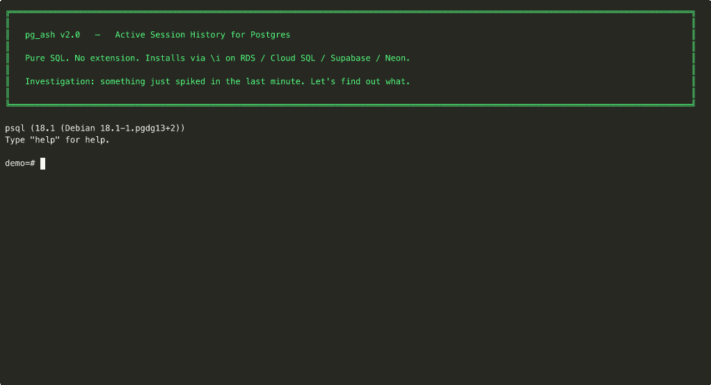
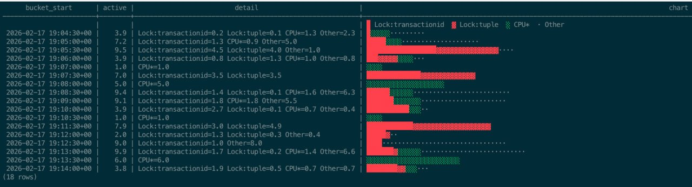

# pg_ash

[](https://github.com/NikolayS/pg_ash/actions/workflows/test.yml)
[](https://github.com/NikolayS/pg_ash)
[](https://github.com/NikolayS/pg_ash/blob/main/LICENSE)
[](https://github.com/NikolayS/pg_ash)
[-brightgreen)](https://github.com/NikolayS/pg_ash/actions/workflows/test.yml)

Active Session History for Postgres — lightweight wait event sampling with zero bloat.

**The anti-extension.** Pure SQL + PL/pgSQL that works on any Postgres 14+ — including RDS, Cloud SQL, AlloyDB, Supabase, Neon, and every other managed provider. No C extension, no `shared_preload_libraries`, no provider approval, no restart. Just `\i` and go.



*Short walkthrough of the [LLM-assisted investigation](#llm-assisted-investigation) flow against a live row-lock spike in Postgres 18. Source: [`demos/`](demos/).*

## Why

Postgres has no built-in session history. When something was slow an hour ago, there is nothing to look at. pg_ash samples `pg_stat_activity` every second and stores the results in a compact format queryable with plain SQL.

### How it compares

| | pg_ash | pg_wait_sampling | pgsentinel | External sampling |
|---|---|---|---|---|
| Install | `\i` (pure SQL) | shared_preload_libraries | shared_preload_libraries (package or compile) | Separate infra |
| Works on managed (RDS, Cloud SQL, Supabase, ...) | Yes | Cloud SQL only (limited managed support) | Not known to be supported | Yes, with effort |
| Sampling rate | 1s (via pg_cron, system cron, or any scheduler) | 10ms (in-process) | 10ms (in-process) | 15-60s typical |
| Visibility | Inside Postgres | Inside Postgres | Inside Postgres | Outside only |
| Storage | Disk (~30 MiB/day) | Memory only | Memory only | External store |
| Historical queries | Yes (persistent) | Ring buffer (lost on restart) | Ring buffer (lost on restart) | Depends on setup |
| Pure SQL | Yes | No (C extension) | No (C extension) | No |
| Maintenance overhead | None | None | None | High |
| Requirements | None (pg_cron optional) | shared_preload_libraries (restart required) | shared_preload_libraries (restart required) | Agent + storage |

## Quick start

```sql
-- prerequisites (optional but recommended)
create extension if not exists pg_stat_statements;  -- enables query text + execution metrics
-- pg_cron is optional: if installed, ash.start() uses it; otherwise see "Scheduling without pg_cron"

-- install (just run the SQL file — works on RDS, Cloud SQL, AlloyDB, etc.)
\i sql/ash-install.sql

-- start sampling (1 sample/second — uses pg_cron if available, otherwise prints external scheduling instructions)
select ash.start('1 second');

-- wait a few minutes, then query
select * from ash.periods();                       -- triage: the standard windows
select * from ash.top('wait_event_type');          -- what kind of load? (last hour)
select * from ash.top('query_id');                 -- which queries?

-- stop sampling
select ash.stop();

-- uninstall (drops the ash schema and pg_cron jobs)
select ash.uninstall('yes');
```

### Sampling intervals

`ash.start(interval)` accepts PostgreSQL interval values. The interval is converted to a pg_cron schedule:

| Interval range | Example input | pg_cron schedule | Description |
|----------------|---------------|------------------|-------------|
| 1–59 seconds | `'1 second'` .. `'59 seconds'` | `N seconds` | Every N seconds (native pg_cron format) |
| 1–59 minutes | `'1 minute'` .. `'59 minutes'` | `*/N * * * *` | Every N minutes via cron syntax |
| 1–23 hours | `'1 hour'` .. `'23 hours'` | `0 */N * * *` (or `0 * * * *` for 1h) | Every N hours via cron syntax (max 23h) |

**Notes:**
- Sub-minute intervals must be exact seconds (e.g., `'30 seconds'`)
- Minute and hour intervals must be exact (e.g., `'5 minutes'` works, `'90 seconds'` does not — use `'1 minute'` instead)
- Hour intervals are limited to 23 hours maximum (cron syntax limitation). For daily sampling, use `'23 hours'` or consider a different approach
- The default and recommended interval is `'1 second'` for high-resolution sampling
- See `select * from ash.status()` for the current sampling interval

### Privileges

The role that runs sampling (the owner of `ash.take_sample()`, or the pg_cron
job owner) should be a superuser **or** a member of the built-in
`pg_read_all_stats` role. Without it, `pg_stat_activity.query_id` is visible
only for activity owned by the sampling role; queries run by other users come
back with `query_id = NULL`, which ash records under the sentinel value `0`.

This silently skews `ash.top('query_id', …)` and any per-query drill-down —
all of that "other-user" traffic collapses into a single `query_id = 0`
bucket. To grant the role:

```sql
-- as a superuser
grant pg_read_all_stats to <sampling_role>;
```

On managed services where `pg_read_all_stats` is already granted to the
primary admin (RDS `rds_superuser`, Cloud SQL `cloudsqlsuperuser`, Supabase
`postgres`), installing and running ash as that role is sufficient. Always
verify with `select pg_has_role(current_user, 'pg_read_all_stats', 'MEMBER');`.

If the privilege probe itself errors (e.g. missing `pg_roles` access on a
locked-down managed service), `ash.start()` does not abort — it emits a
`RAISE NOTICE 'privilege probe failed: ...'` so the skipped check remains
visible in server / CI logs.

### Upgrade

```sql
-- from 1.0 to 1.1
\i sql/ash-1.0-to-1.1.sql

-- from 1.1 to 1.2
\i sql/ash-1.1-to-1.2.sql

-- from 1.2 to 1.3
\i sql/ash-1.2-to-1.3.sql

-- from 1.3 to 1.4
\i sql/ash-1.3-to-1.4.sql

-- from 1.4 to 1.5
\i sql/ash-1.4-to-1.5.sql  -- atomic wrapper; run with ON_ERROR_STOP enabled

-- check version
select * from ash.status();
```

## Function reference

### Admin

| Function | Description |
|----------|-------------|
| `ash.start(interval)` | Start sampling (default: `'1 second'`). Uses pg_cron if available, otherwise prints external scheduling instructions. Also schedules rollup jobs. **Admin-only** |
| `ash.stop()` | Stop sampling and rollups (removes pg_cron jobs, sets `sampling_enabled = false`). **Admin-only** |
| `ash.status()` | Sampling status, version, partition info, rollup metrics, debug_logging state. Reader-safe |
| `ash.take_sample()` | Take one sample manually (called automatically by the scheduler). Writes to raw sample/query-map partitions and updates counters. **Admin-only** |
| `ash.rotate()` | Rotate sample partitions (called automatically, or manually for external schedulers). Runs pre-truncation rollup, then truncates the retired raw sample/query-map slot. **Admin-only** |
| `ash.rebuild_partitions(N, 'yes')` | Change partition count (3–32). **Admin-only and destructive** — all raw sample and query-map partition data is lost; requires the exact `'yes'` confirmation token. Rollup tables survive. Call `ash.start()` after to resume |
| `ash.rollup_minute([batch])` | Aggregate raw samples into per-minute rollups. Watermark-based with catch-up. Default batch: 60 minutes. **Admin-only** |
| `ash.rollup_hour()` | Aggregate minute rollups into hourly rollups. Watermark-based. **Admin-only** |
| `ash.rollup_cleanup()` | Delete expired rollup rows per retention config. **Admin-only** |
| `ash.set_debug_logging([bool])` | Enable/disable per-session RAISE LOG in `take_sample()` for diagnostics. Call with no argument to check current state. **Admin-only** |
| `ash.grant_reader(role)` / `ash.revoke_reader(role)` | Grant/revoke the minimum monitoring-reader privilege bundle. **Admin-only** |
| `ash.uninstall('yes')` | Drop the `ash` schema and remove pg_cron jobs. **Admin-only and destructive**; requires the exact `'yes'` confirmation token |

### Readers

**pg_ash 2.0 is a breaking change.** The v1.x reader API (`top_waits`,
`top_queries`, `wait_timeline`, `activity_summary`, `timeline_chart`,
`query_waits`, `event_queries`, `samples_by_database`, their `_at` twins, and
the interim `aas_*` drafts) has been **removed** and replaced by the compact
surface below. Full spec: [`blueprints/AAS_API.md`](blueprints/AAS_API.md).
A before/after mapping of every old function to its 2.0 replacement:
[`blueprints/AAS_EXAMPLES.md`](blueprints/AAS_EXAMPLES.md).

Every reader answers in **AAS** (average active sessions): `avg_aas`,
`peak_aas`, `p99_aas`, with `backend_seconds` as a secondary absolute column
and a `source` column (`raw` / `rollup_1m` / `rollup_1h` / `mixed`) showing
where the data came from. `peak_aas` / `p99_aas` are the max / 99th percentile
of per-bucket AAS, so a short spike stays visible next to the average. Every
reader takes `p_from timestamptz default null` (→ `now() - '1 hour'`) and
`p_to timestamptz default null` (→ `now()`), plus the uniform optional filters
`p_wait_event_type`, `p_wait_event`, `p_query_id`, `p_database` where they
apply. "Last 24 hours" is `p_from => now() - interval '24 hours'`.

| Function | Question it answers |
|----------|---------------------|
| `ash.periods([end])` | **Start here.** One row per standard trailing window (1m, 5m, 1h, 1d, 1w, 1mo): is it bad right now — a spike or sustained? |
| `ash.aas(from, to, filters…, [bucket])` | Scalar load for one window (avg / peak / p99 AAS, backend_seconds). Also the leaf summary, e.g. `ash.aas(p_wait_event => 'IO:DataFileRead')` |
| `ash.timeline(from, to, [bucket], filters…)` | AAS time series, one row per bucket; `data_points = 0` marks a no-data bucket (distinct from measured zero). `bucket => null` auto-selects grain by span |
| `ash.top(dimension, from, to, filters…, [limit], [bucket])` | The single drill. `dimension` ∈ `wait_event_type` / `wait_event` / `query_id` / `database`; filters compose |
| `ash.compare(from1, to1, from2, to2, [dimension], filters…)` | Before/after two-window diff — did the deploy change load, and where? |
| `ash.samples(from, to, [limit], filters…)` | Decoded raw sample rows, newest first |
| `ash.report(from, to, [vcpus], [top])` → `jsonb` | One machine-readable load report for external monitoring / health-assessment platforms — a single call, no follow-up queries |
| `ash.chart(from, to, [bucket], [top], [width], [color])` | Human: stacked ASCII AAS timeline (the `timeline_chart` replacement) |
| `ash.summary(from, to)` | Human: key/value overview (the `activity_summary` replacement) |

`ash.top` composes its filters with the dimension, giving every v1.x drill as
one grammar:

```sql
select * from ash.top('wait_event_type');                              -- level 1
select * from ash.top('wait_event', p_wait_event_type => 'IO');        -- level 2
select * from ash.top('query_id');                                     -- top queries
select * from ash.top('wait_event', p_query_id => 8231004856741017);   -- query → waits
select * from ash.top('query_id', p_wait_event => 'IO:DataFileRead');  -- event → queries (leaf)
```

Readers auto-select their source by window — `raw` within raw retention, else
`rollup_1m`, else `rollup_1h` — and report it in the `source` column, so they
keep working after raw samples have rotated away. A drill that needs the
wait↔query tie (a query filter combined with a wait filter) can only be
answered from raw samples; if the requested window predates raw retention the
reader **raises a clear error naming the boundary** rather than returning a
silently empty result.

On-CPU / uninstrumented work is spelled `CPU*` everywhere (the asterisk is
load-bearing — such a sample is either genuine on-CPU work or a Postgres code
path with no wait event; never "clean" it to `CPU`). Only `ash.report`'s JSON
payload uses a lowercase `cpu` key.

### Helpers

| Function | Description |
|----------|-------------|
| `ash.ts_from_timestamptz(timestamptz)` | Convert timestamptz to internal int4 epoch offset (useful for querying rollup tables directly) |
| `ash.ts_to_timestamptz(int4)` | Convert int4 epoch offset back to timestamptz |
| `ash.decode_sample(integer[], smallint)` | Decode a single packed `ash.sample.data` array. Pass `slot` for unambiguous query_id resolution |
| `ash.decode_sample(int4)` | Convenience: decode every `ash.sample` row at the given `sample_ts` (across all datids/slots). Returns `(datid, wait_event, query_id, count)` |
| `ash.decode_sample_at(timestamptz)` | Same as above but accepts `timestamptz` (converted via `ts_from_timestamptz`). The `_at` suffix avoids `decode_sample(unknown)` overload ambiguity |

`decode_sample` / `decode_sample_at` have `EXECUTE` revoked from `PUBLIC` (per the privilege hardening in #45). Grant explicitly to roles that need them, e.g. `grant execute on function ash.decode_sample(int4) to my_reader;`.

#### Example

```sql
-- All decoded backends recorded at a specific moment, by database:
select db.datname, d.wait_event, d.query_id, d.count
from ash.decode_sample_at('2026-04-19 14:30:00+00'::timestamptz) d
join pg_database db on db.oid = d.datid
order by db.datname, d.wait_event;
```

## Usage

### Check status

```sql
select * from ash.status();
```

```
           metric           |             value
----------------------------+-------------------------------
 version                    | 1.5
 color                      | off
 num_partitions             | 3
 sampling_enabled           | true
 skipped_samples            | 0
 current_slot               | 0
 sample_interval            | 00:00:01
 rotation_period            | 1 day
 raw_retention              | 1 day + current partial
 include_bg_workers         | false
 debug_logging              | false
 installed_at               | 2026-02-16 08:30:00.000000+00
 rotated_at                 | 2026-02-16 08:30:00.000000+00
 time_since_rotation        | 00:09:03.123456
 last_sample_ts             | 2026-02-16 08:39:03+00
 samples_in_current_slot    | 56
 samples_total              | 56
 wait_event_map_count       | 11
 wait_event_map_utilization | 0.03%
 query_map_count            | 8
 rollup_1m_rows             | 540
 rollup_1m_oldest           | 2026-02-16 08:30:00+00
 rollup_1m_newest           | 2026-02-16 08:39:00+00
 rollup_1m_retention        | 30 days
 rollup_1h_rows             | 0
 rollup_1h_retention        | 1825 days
 pg_cron_available          | yes
```

### What hurt recently?

Start with `ash.periods()` — the six standard windows side by side. `peak_aas`
far above `avg_aas` means a spike; both high means sustained load.

```sql
select * from ash.periods();
```

```
 period | period_start        | source    | minutes_with_data | avg_aas | peak_aas | p99_aas
--------+---------------------+-----------+-------------------+---------+----------+---------
 1m     | 2026-07-04 14:44:00 | raw       |                 1 |    2.9  |     3.4  |    3.4
 5m     | 2026-07-04 14:40:00 | raw       |                 5 |    3.1  |     4.0  |    3.9
 1h     | 2026-07-04 13:45:00 | rollup_1m |                60 |    3.2  |    41.0  |   12.7
 1d     | 2026-07-03 14:45:00 | rollup_1m |              1440 |    2.8  |    41.0  |    6.3
 1w     | 2026-06-27 14:45:00 | rollup_1h |             10080 |    2.6  |    41.0  |    5.9
 1mo    | 2026-06-04 14:45:00 | rollup_1h |             43200 |    2.5  |    41.0  |    5.7
```

The last hour averaged 3.2 but peaked at 41 — a spike, not a sustained shift.
`ash.summary()` renders the same picture as a key/value overview for humans.

```sql
-- what is the load, broken down by wait event type?
select * from ash.top('wait_event_type', p_from => now() - interval '5 minutes');
```

```
 key    | query_text | source | avg_aas | peak_aas | p99_aas | backend_seconds |  pct
--------+------------+--------+---------+----------+---------+-----------------+-------
 IO     |            | raw    |   15.8  |    33.0  |   31.5  |           14210 |  62.4
 Lock   |            | raw    |    4.6  |    12.0  |   11.2  |            4180 |  18.4
 CPU*   |            | raw    |    3.8  |     6.0  |    5.7  |            3390 |  14.9
 LWLock |            | raw    |    1.1  |     3.0  |    2.8  |             980 |   4.3
```

`peak_aas` per row tells a spiky class apart from a steadily-busy one — `IO`
here is both the largest and the spikiest.

```sql
-- top queries by load; query_text comes from pg_stat_statements when present
select * from ash.top('query_id', p_from => now() - interval '5 minutes', p_limit => 3);
```

```
       key         |            query_text             | source | avg_aas | peak_aas | p99_aas | backend_seconds |  pct
-------------------+-----------------------------------+--------+---------+----------+---------+-----------------+------
  8231004856741017 | select o.*, c.name from orders o… | raw    |   13.2  |    30.0  |   28.7  |           11890 | 52.2
  -882290014352918 | update inventory set qty = qty -… | raw    |    3.4  |     9.0  |    8.5  |            3020 | 13.3
  4411002933801220 | select count(*) from events wher… | raw    |    1.6  |     3.0  |    2.9  |            1470 |  6.5
```

### Analyze a specific query

```sql
-- what is query 8231004856741017 waiting on? (query → waits)
select * from ash.top('wait_event', p_query_id => 8231004856741017,
                       p_from => now() - interval '5 minutes');
```

```
 key             | query_text | source | avg_aas | peak_aas | p99_aas | backend_seconds |  pct
-----------------+------------+--------+---------+----------+---------+-----------------+------
 IO:DataFileRead |            | raw    |   11.2  |    26.0  |   24.9  |           10110 | 85.0
 CPU*            |            | raw    |    1.4  |     3.0  |    2.8  |            1300 | 10.9
```

Combining a query filter with a wait filter needs the raw wait↔query tie; the
window must lie within raw retention or the reader raises with the boundary.

### Drill into a wait event

```sql
-- how spiky is DataFileRead itself? (the leaf summary)
select avg_aas, peak_aas, p99_aas
from ash.aas(p_wait_event => 'IO:DataFileRead', p_from => now() - interval '5 minutes');

-- which queries drive it? (event → queries)
select * from ash.top('query_id', p_wait_event => 'IO:DataFileRead',
                       p_from => now() - interval '5 minutes');
```

### Browse raw samples

```sql
-- see the last 20 decoded samples with query text
select * from ash.samples(p_from => now() - interval '10 minutes', p_limit => 20);
```

```
      sample_time       | database_name | active_backends |     wait_event     |       query_id       |                          query_text
------------------------+---------------+-----------------+--------------------+----------------------+--------------------------------------------------------------
 2026-02-16 11:18:51+00 | postgres      |               7 | CPU*               | -2835399305386018931 | END
 2026-02-16 11:18:51+00 | postgres      |               7 | CPU*               |  3365820675399133794 | UPDATE pgbench_branches SET bbalance = bbalance + $1 WHERE ...
 2026-02-16 11:18:49+00 | postgres      |               5 | Client:ClientRead  |  9144568883098003499 | SELECT abalance FROM pgbench_accounts WHERE aid = $1
 2026-02-16 11:18:49+00 | postgres      |               5 | IO:WalSync         | -2835399305386018931 | END
 2026-02-16 11:18:49+00 | postgres      |               3 | Lock:transactionid | -2835399305386018931 | END
 2026-02-16 11:18:49+00 | postgres      |               5 | LWLock:WALWrite    | -2835399305386018931 | END
```

```sql
-- raw samples during an incident
select * from ash.samples(p_from => '2026-02-14 03:00', p_to => '2026-02-14 03:05', p_limit => 50);
```

### Dump samples to CSV

Always go through `ash.samples()` — the underlying `ash.sample` table stores a
packed `integer[]` and cannot be joined directly. The defaults are
`p_from => now() - '1 hour'`, `p_to => now()`, and `p_limit => 100`; pass a
large `p_limit` when dumping.

```sql
-- dump every sample from the last hour
\copy (select * from ash.samples(p_from => now() - interval '1 hour', p_limit => 10000000)) to '/tmp/ash.csv' csv header

-- dump a specific incident window
\copy (select * from ash.samples(p_from => '2026-02-14 03:00', p_to => '2026-02-14 03:05', p_limit => 10000000)) to '/tmp/incident.csv' csv header
```

Use `\copy` (psql) rather than server-side `COPY TO` if `/tmp` isn't writable by
the Postgres user (managed services), and check the exit status — silently
redirecting stderr to `/dev/null` will hide errors like typos in table names.

### Timeline chart

Visualize wait event patterns over time — spot spikes, correlate with deployments, see what changed.

`ash.chart` renders the AAS timeline as a stacked ASCII bar chart (`ash.timeline`
is the typed-data companion). The `chart` column stacks the top wait events per
bucket; `aas` is the bucket total.

```sql
select bucket_start, aas, detail, chart
from ash.chart(p_from => now() - interval '5 minutes', p_bucket => '1 minute');
```

```
      bucket_start       |  aas  |                             detail                             |                           chart
-------------------------+-------+----------------------------------------------------------------+-----------------------------------------------------------
                         |       |                                                                | █ IO:DataFileRead  ▓ Lock:transactionid  ░ CPU*  · Other
 2026-07-04 14:30:00+00  |   3.6 | IO:DataFileRead=2.1 CPU*=0.9 Other=0.6                          | ███████████████▓▓░░····
 2026-07-04 14:31:00+00  |   4.0 | IO:DataFileRead=2.4 CPU*=1.0 Other=0.6                          | ████████████████▓▓░░····
 2026-07-04 14:32:00+00  |  24.8 | IO:DataFileRead=18.2 Lock:transactionid=4.1 CPU*=1.4 Other=1.1  | ██████████████████████████████▓▓▓▓▓▓░░···
 2026-07-04 14:33:00+00  |   6.1 | IO:DataFileRead=4.0 Lock:transactionid=1.0 CPU*=0.6 Other=0.5   | ████████████████▓▓▓▓░░··
 2026-07-04 14:34:00+00  |   3.8 | IO:DataFileRead=2.3 CPU*=0.9 Other=0.6                          | ███████████████▓▓░░····
```

Each rank gets a distinct character — `█` (rank 1), `▓` (rank 2), `░` (rank 3), `▒` (rank 4+), `·` (Other) — so the breakdown is visible without color. Buckets are at least one minute (the rollup grain); `p_bucket => null` auto-selects the grain by span.

```sql
-- zoom into a specific time window
select * from ash.chart(
  p_from => now() - interval '10 minutes', p_to => now(),
  p_bucket => '1 minute', p_top => 3, p_width => 50
);
```

**Experimental: ANSI colors.** Enable per-session or per-call — green = CPU\*, blue = IO, red = Lock, pink = LWLock, cyan = IPC, yellow = Client, orange = Timeout, teal = BufferPin, purple = Activity, light purple = Extension, light yellow = IdleTx.

```sql
-- Option 1: enable once for the session (recommended)
set ash.color = on;

-- Option 2: per-call
select * from ash.chart(p_from => now() - interval '1 hour', p_color => true);
```

psql's table formatter escapes ANSI codes — to render colors, pipe through sed:

```
-- add to ~/.psqlrc for a reusable :color command
\set color '\\g | sed ''s/\\\\x1B/\\x1b/g'' | less -R'

-- then use it
select * from ash.chart(p_from => now() - interval '1 hour') :color
```

Colors also render natively in pgcli, DataGrip, and other clients that pass raw bytes.

`ash.chart` with colors (the stacked AAS timeline; the ANSI rendering is unchanged from v1.x):



Example data generated with `pgbench -c 8 -T 65` on Postgres 17 with concurrent lock contention and idle-in-transaction sessions.

### Investigate an incident

Pass absolute timestamps as `p_from` / `p_to` to zoom into a specific window:

```sql
-- what was the load between 3:00 and 3:10 am?
select * from ash.aas(p_from => '2026-02-14 03:00', p_to => '2026-02-14 03:10');

-- what and who? (breakdown by wait event, then by query)
select * from ash.top('wait_event', p_from => '2026-02-14 03:00', p_to => '2026-02-14 03:10');
select * from ash.top('query_id',   p_from => '2026-02-14 03:00', p_to => '2026-02-14 03:10');

-- minute-by-minute timeline of the incident
select * from ash.timeline(p_from => '2026-02-14 03:00', p_to => '2026-02-14 03:10', p_bucket => '1 minute');

-- did a deploy at 03:05 change the load, and where?
select * from ash.compare(
  '2026-02-14 02:55', '2026-02-14 03:05',   -- before
  '2026-02-14 03:05', '2026-02-14 03:15',   -- after
  p_dimension => 'wait_event');
```

### Machine ingestion

`ash.report()` returns one self-contained `jsonb` load report for a window —
designed so an external monitoring or health-assessment platform can ingest
pg_ash with a single call and no follow-up queries. Per-class per-minute AAS
(`total` / `cpu` / `io` / `ipc` / `lock` / `lwlock`) drives `aas_avg` /
`aas_worst1m` / `aas_p99` / `aas_p999`, plus `top_events_*` and
`top_queryids_*`. Scoring, thresholds, and normalization against vCPU counts
are the consumer's job; pg_ash emits raw AAS numbers only.

```sql
select ash.report(p_from => now() - interval '1 day');
```

The payload contract is frozen per 2.0 minor line (keys are only ever added,
never renamed or removed). It returns `null` when the window has no coverage.

### LLM-assisted investigation

pg_ash functions chain naturally for how an LLM investigates a problem — each answer tells it what to ask next.

**Prompt:** *"There was a performance issue about 5 minutes ago. Investigate."*

Step 1 — the LLM checks the big picture:

```sql
select * from ash.periods();
```

```
 period | source    | minutes_with_data | avg_aas | peak_aas | p99_aas
--------+-----------+-------------------+---------+----------+---------
 1m     | raw       |                 1 |    2.2  |     2.4  |    2.4
 5m     | raw       |                 5 |    5.1  |    12.0  |   11.4
 1h     | rollup_1m |                60 |    2.6  |    12.0  |    4.8
```

*"The 5-minute window averages 5.1 AAS but peaked at 12 — something spiked in the last few minutes."*

Step 2 — drill into the waits:

```sql
select * from ash.top('wait_event', p_from => now() - interval '10 minutes');
```

```
 key             | query_text | source | avg_aas | peak_aas | p99_aas | backend_seconds |  pct
-----------------+------------+--------+---------+----------+---------+-----------------+------
 Lock:tuple      |            | raw    |    3.5  |    10.0  |    9.4  |            2810 | 68.0
 CPU*            |            | raw    |    1.0  |     2.0  |    1.9  |             830 | 20.0
 IO:DataFileRead |            | raw    |    0.4  |     1.0  |    0.9  |             290 |  7.0
```

*"Lock:tuple is 68% of the load and spiky (peak 10 vs avg 3.5) — sessions fighting over the same rows."*

Step 3 — locate the spike in time:

```sql
select * from ash.timeline(p_from => now() - interval '10 minutes', p_bucket => '1 minute', p_wait_event => 'Lock:tuple');
```

```
      bucket_start       | source | data_points | avg_aas | peak_aas | p99_aas
-------------------------+--------+-------------+---------+----------+---------
 2026-02-17 14:00:00+00  | raw    |          60 |    0.5  |     1.0  |    1.0
 2026-02-17 14:01:00+00  | raw    |          60 |    3.2  |    10.0  |    9.6
 2026-02-17 14:02:00+00  | raw    |          60 |    9.4  |    12.0  |   11.8
 2026-02-17 14:03:00+00  | raw    |          60 |    1.2  |     2.0  |    1.9
 2026-02-17 14:04:00+00  | raw    |          60 |    0.4  |     1.0  |    0.9
```

*"The spike is 14:01 to 14:02 — peak_aas 12 while the minute averages settle back after. Let me find which queries drove Lock:tuple in that window."*

Step 4 — find the guilty queries (event → queries, the leaf drill):

```sql
select * from ash.top('query_id', p_wait_event => 'Lock:tuple',
                       p_from => '2026-02-17 14:01:30', p_to => '2026-02-17 14:02:30');
```

```
    key     |                query_text                   | source | avg_aas | peak_aas | p99_aas | backend_seconds |  pct
------------+---------------------------------------------+--------+---------+----------+---------+-----------------+------
 7283901445 | UPDATE orders SET status = $1 WHERE id = $2  | raw    |    8.2  |    11.0  |   10.6  |             412 | 85.0
 9102384756 | UPDATE orders SET shipped_at = $1 WHERE id…  | raw    |    1.1  |     2.0  |    1.9  |              53 | 11.0
```

*"Query 7283901445 is 85% of the lock waits, and query_text (from pg_stat_statements) already tells me the statement."*

**LLM's conclusion:**

> Root cause: multiple concurrent `UPDATE orders ... WHERE id = $2` statements are contending
> on the same rows (`Lock:tuple`). Two different update patterns hit the `orders` table —
> status updates and shipping updates — and when they target overlapping rows, they serialize
> on tuple locks.
>
> Mitigation options:
> 1. Use `SELECT ... FOR UPDATE SKIP LOCKED` to skip already-locked rows and process them later
> 2. Batch the status and shipping updates into a single statement to reduce lock duration
> 3. If these run from a queue worker, reduce concurrency or partition the work by order ID range

## How it works

### Sampling

`ash.take_sample()` runs every second via pg_cron. It reads `pg_stat_activity`, groups active backends by `(wait_event_type, wait_event, state)`, and encodes the result into a single `integer[]` per database:

```
{-5, 3, 101, 102, 103, -1, 2, 104, 105, -8, 1, 106}
 │   │  │              │  │  │           │  │  │
 │   │  └─ query_ids   │  │  └─ qids     │  │  └─ qid
 │   └─ count=3        │  └─ count=2     │  └─ count=1
 └─ wait_event_id=5    └─ weid=1         └─ weid=8
```

6 active backends across 3 wait events = 1 row, 12 array elements. Each query_id is one backend — if two backends run the same query, the same map_id appears twice (the count reflects total backends, not distinct queries). Full row size: 24 (tuple header) + 4 (sample_ts) + 4 (datid) + 2 (active_count) + 2 (slot) + 68 (array: 20-byte header + 12 × 4) + alignment = **106 bytes** (measured with `pg_column_size`).

### Dictionary tables

| Table | Purpose |
|-------|---------|
| `ash.wait_event_map` | Maps `(state, wait_event_type, wait_event)` to integer IDs |
| `ash.query_map_0..{N-1}` | Maps `query_id` (from `pg_stat_activity`) to integer IDs (one per sample partition, truncated on rotation) |
| `ash.rollup_1m` | Per-minute aggregated samples (30-day retention) |
| `ash.rollup_1h` | Per-hour aggregated rollups (5-year retention) |

Dictionaries are auto-populated by the sampler. Wait events are stable (~600 entries max across all Postgres versions). Query map grows as new queries appear and is garbage-collected based on `last_seen`.

Encoding version is tracked in `ash.config.encoding_version`, not in the array itself — zero per-row overhead.

**Note on `CPU*`**: When `wait_event_type` and `wait_event` are both NULL in `pg_stat_activity`, the backend is active but not in a known wait state. This is *either* genuine CPU work *or* an uninstrumented code path where Postgres does not report a wait event. The asterisk signals this ambiguity. See [gaps.wait.events](https://gaps.wait.events) for details on uninstrumented wait events in Postgres — these gaps are being closed over time, making `CPU*` increasingly accurate.

### Rotation

Skytools PGQ-style N-partition ring buffer (default N=3, configurable 3–32 via `ash.rebuild_partitions(N, 'yes')`). Physical tables (`sample_0` through `sample_{N-1}`) rotate at `rotation_period` intervals. TRUNCATE replaces the oldest partition — zero dead tuples, zero bloat, no VACUUM needed for sample tables.

N-1 partitions hold data at any time. One is always empty, ready for the next rotation. Before truncation, `rotate()` calls `rollup_minute()` to aggregate endangered samples into rollup tables.

```
┌──────────┐  ┌───────────┐  ┌──────────┐    ┌───────────────┐
│ sample_0 │  │ sample_1  │  │ sample_2 │    │ sample_{N-1}  │
│ (today)  │  │(yesterday)│  │ (empty)  │... │ (readable)    │
│ writing  │  │ readable  │  │ next     │    │               │
└──────────┘  └───────────┘  └──────────┘    └───────────────┘
                              ↑ TRUNCATE + rotate
```

### Reader optimization

Reader functions decode arrays inline using `generate_subscripts()` with direct array subscript access. This avoids per-row plpgsql function calls and is 9-17x faster than the `CROSS JOIN LATERAL decode_sample()` approach.

## Storage

### Raw samples

| Active backends | Storage/day | Max on disk (N-1 partitions, default N=3) |
|----------------|------------|---------------------------|
| 10 | 11 MiB | 22 MiB |
| 50 | 30 MiB | 60 MiB |
| 100 | 50 MiB | 100 MiB |
| 200 | 100 MiB | 200 MiB |
| 500 | 245 MiB | 490 MiB |

At 500+ backends, TOAST LZ4 compression reduces actual storage. Increasing `num_partitions` increases the number of days kept, not the daily rate.

### Rollup tables

| Level | Retention | Rows/db | Storage/db |
|-------|----------|---------|-----------|
| 1-minute (`rollup_1m`) | 30 days | ~43,200 | ~43 MiB |
| 1-hour (`rollup_1h`) | 5 years | ~43,800 | ~77 MiB |

Total: ~120 MiB per database for 5 years of trend data.

## Performance

Measured on Postgres 17, 50 backends, 1s sampling, `jit = off` (median of 10 runs, warm cache):

| Metric | Result |
|--------|--------|
| `top('wait_event')` over 1 hour (rollup-backed) | 30 ms |
| `top('query_id')` over 1 hour | 31 ms |
| `report()` over 1 day (raw-backed) | < 1 s |
| `take_sample()` overhead | 53 ms |
| WAL per sample | ~29 KiB (~2.4 GiB/day) |
| Rotation (1-day partition) | 9 ms |
| Dead tuples after rotation | 0 |

See [issue #1](https://github.com/NikolayS/pg_ash/issues/1) for full benchmarks — EXPLAIN ANALYZE output, backend scaling, multi-database tests, WAL analysis, and concurrency testing.

## Requirements

- Postgres 14+ (requires `query_id` in `pg_stat_activity`)
- pg_cron 1.5+ (optional — for built-in scheduling; see [Scheduling without pg_cron](#scheduling-without-pg_cron) for alternatives)
- pg_stat_statements (optional but recommended — enables `query_text`; without it every reader still works, and `ash.top('query_id', …)` / `ash.samples()` simply return NULL for `query_text`)

**Note on `query_id`**: The default `compute_query_id = auto` only populates `query_id` when pg_stat_statements is in `shared_preload_libraries`. If `query_id` is NULL in `pg_stat_activity`, set:

```sql
alter system set compute_query_id = 'on';
-- requires reload: select pg_reload_conf();
```

## Configuration

```sql
-- change sampling interval (default: 1 second)
select ash.stop();
select ash.start('5 seconds');

-- change rotation interval (default: 1 day)
update ash.config set rotation_period = '12 hours';

-- check current configuration
select * from ash.status();
```

### Defaults

All configuration is in the `ash.config` singleton table:

| Setting | Default | Description |
|---------|---------|-------------|
| `sample_interval` | `1 second` | Time between samples |
| `rotation_period` | `1 day` | How often partitions rotate |
| `num_partitions` | `3` | Number of sample partitions (3–32) |
| `include_bg_workers` | `false` | Sample autovacuum, logical replication, parallel workers |
| `debug_logging` | `false` | RAISE LOG for every sampled session |
| `rollup_1m_retention_days` | `30` | How long to keep minute-level rollups |
| `rollup_1h_retention_days` | `1825` | How long to keep hourly rollups (5 years) |
| `rollup_min_backend_seconds` | `3` | Minimum backend-seconds for a query to appear in rollup query_counts |

### Configurable partitions

By default, pg_ash uses 3 partitions (1 day of history + current partial). To keep more raw sample history, increase the partition count:

```sql
-- keep 7 days of raw samples (9 partitions × 1-day rotation = 7 readable days + current)
-- 'yes' is required because the call drops all raw sample data
select ash.rebuild_partitions(9, 'yes');

-- resume sampling after rebuild
select ash.start();

-- verify
select * from ash.status();
--  num_partitions  | 9
--  raw_retention   | 7 days + current partial
```

The retention formula is `(N - 2) × rotation_period`. The minimum is 3 (current + previous + one being truncated), the maximum is 32.

`rebuild_partitions()` is **destructive** — all raw samples are lost. To prevent accidents, the call requires a `'yes'` confirmation token (e.g. `ash.rebuild_partitions(9, 'yes')`); calling it without `'yes'` raises an error and changes nothing. Rollup tables survive. You must call `ash.start()` afterward to resume sampling.

### Rollup tables for long-term trends

Raw samples rotate away after `(N-2) × rotation_period`. Rollup tables preserve aggregated data for long-term trend analysis:

- **`rollup_1m`**: per-minute aggregates, kept for 30 days (~43 MiB/db)
- **`rollup_1h`**: per-hour aggregates, kept for 5 years (~77 MiB/db)

Rollups are populated automatically when pg_cron is available (`ash.start()` schedules them). Without pg_cron, schedule externally:

```bash
# Every minute: aggregate raw samples into minute rollups
* * * * * psql -qAtX -d mydb -c "SELECT ash.rollup_minute();"

# Every hour: aggregate minutes into hourly rollups
0 * * * * psql -qAtX -d mydb -c "SELECT ash.rollup_hour();"

# Daily at 3am: delete expired rollup rows
0 3 * * * psql -qAtX -d mydb -c "SELECT ash.rollup_cleanup();"
```

The rollups are not a separate API — the **same 2.0 readers** query them.
Each reader auto-selects its source by window (raw within raw retention, else
`rollup_1m`, else `rollup_1h`) and reports it in the `source` column, so a long
window transparently reads the rollups even after raw samples have rotated away:

```sql
-- long windows just widen p_from; source switches to the rollups automatically
select * from ash.top('wait_event', p_from => now() - interval '6 hours');   -- top waits, 6h
select * from ash.top('query_id',   p_from => now() - interval '7 days');    -- top queries, 1w

-- scalar AAS over a window. avg is the window average; peak/p99 are the worst /
-- 99th-percentile per-bucket AAS, so a short storm is not hidden by the average.
-- Pass a coarser bucket to smooth, e.g. p_bucket => '5 minutes'.
select * from ash.aas(p_from => now() - interval '1 day');

-- all standard windows side by side (1 minute ... 1 month)
select * from ash.periods();

-- an arbitrary absolute period (works even after raw samples are gone)
select * from ash.aas(p_from => '2026-03-01 02:00', p_to => '2026-03-01 03:00');

-- TIME: a series of AAS points to visualize load and locate spikes. p_bucket
-- null auto-selects grain; order by peak_aas to surface the busiest buckets.
select bucket_start, source, avg_aas, peak_aas
from ash.timeline(p_from => now() - interval '7 days')
order by peak_aas desc;

-- NATURE: drill the hierarchy on a chosen window with one function.
select * from ash.top('wait_event_type', p_from => now() - interval '15 minutes');        -- level 1
select * from ash.top('wait_event', p_wait_event_type => 'IO',
                      p_from => now() - interval '15 minutes');                            -- level 2
select * from ash.top('query_id', p_from => now() - interval '15 minutes', p_limit => 20);-- queries

-- the deepest leaf, "queries within a specific wait_event", needs the raw
-- wait↔query tie, so it is answerable only within raw retention (the reader
-- raises past that boundary rather than returning empty):
select * from ash.top('query_id', p_wait_event => 'IO:DataFileRead',
                      p_from => now() - interval '15 minutes', p_limit => 20);
```

`avg_aas` is backend-seconds of activity per elapsed wall-clock second; missed
or empty minutes count as zero activity. `peak_aas` and `p99_aas` are the max
and 99th percentile of per-bucket AAS (so `peak_aas` is always ≥ `avg_aas`);
`p_bucket` selects that granularity (must be ≥ 1 minute). All AAS values are
scaled by the configured sample interval, so they stay correct under non-1s
sampling. Trailing windows (a `null` `p_to`) end at the current minute boundary
so they read complete minute rollups; `ash.timeline` reads `rollup_1m` for
short spans (per-minute peaks) and `rollup_1h` for long spans with hour-or-
larger buckets. A trailing partial bucket is averaged over the time it actually
covers; pass an hour- or day-aligned `p_from` for wall-clock-aligned axis labels.

Rollups use backend-seconds as the count unit (Oracle ASH-compatible). Each sample appearance = 1 backend-second at 1s sampling interval.

To change retention:

```sql
update ash.config set rollup_1m_retention_days = 14 where singleton;   -- keep 2 weeks
update ash.config set rollup_1h_retention_days = 365 where singleton;  -- keep 1 year
```

### Debug logging

Enable per-session RAISE LOG output from `take_sample()` — useful for diagnosing connection pooler issues (e.g., PgBouncer mapping `client_addr` to pooler sessions):

```sql
-- check current state
select ash.set_debug_logging();

-- enable: each take_sample() call logs every active session to the Postgres log
select ash.set_debug_logging(true);

-- sample output in the Postgres server log:
-- LOG: ash.take_sample: pid=107 state=active wait_type=CPU* wait_event=CPU* backend_type=client backend query_id=-5287352711091412819
-- LOG: ash.take_sample: pid=108 state=idle in transaction wait_type=Client wait_event=ClientRead backend_type=client backend query_id=-6949053775937549307

-- disable
select ash.set_debug_logging(false);
```

### pg_cron run history

pg_cron logs every job execution to `cron.job_run_details`. At 1-second sampling, this adds ~12 MiB/day of unbounded growth with no built-in purge.

**Recommended: disable `cron.log_run`.** Errors from failed jobs still appear in the Postgres server log (`cron.log_min_messages` defaults to `WARNING`) — you lose nothing important, only the `job_run_details` table entries.

```sql
alter system set cron.log_run = off;
-- requires Postgres restart (postmaster context)
```

If you need run history for other pg_cron jobs (unfortunately, as of pg_cron 1.6, per-job logging configuration is not supported), schedule periodic cleanup instead:

```sql
select cron.schedule(
  'ash_purge_cron_log',
  '0 * * * *',
  $$delete from cron.job_run_details where end_time < now() - interval '1 day'$$
);
```

`ash.start()` will warn about this overhead.

### Scheduling without pg_cron

pg_cron is **optional**. All core functions — `ash.take_sample()`, `ash.rotate()`, and all reporting — work without it. When pg_cron is not installed, `ash.start('1 second')` records the intended interval in `ash.config` and prints instructions for external scheduling.

You can call `ash.take_sample()` from any external scheduler:

**System cron** (1-minute minimum granularity):

```bash
# Every minute
* * * * * psql -qAtX -d mydb -c "SET statement_timeout='500ms'; SELECT ash.take_sample();"

# Every second (cron launches a loop each minute)
* * * * * for i in $(seq 1 59); do psql -qAtX -d mydb -c "SET statement_timeout='500ms'; SELECT ash.take_sample();"; sleep 1; done
```

**Dedicated loop script** (most reliable for 1-second sampling):

```bash
#!/bin/bash
# ash_sampler.sh — run via systemd, screen, tmux, or nohup
while true; do
  psql -qAtX -d mydb -c "SET statement_timeout='500ms'; SELECT ash.take_sample();" 2>/dev/null
  sleep 1
done
```

**systemd timer** (Linux, precise 1-second ticking):

```ini
# /etc/systemd/system/ash-sampler.service
[Service]
Type=oneshot
ExecStart=psql -qAtX -d mydb -c "SET statement_timeout='500ms'; SELECT ash.take_sample();"
User=postgres

# /etc/systemd/system/ash-sampler.timer
[Timer]
OnActiveSec=0
OnUnitActiveSec=1s
AccuracySec=100ms
[Install]
WantedBy=timers.target
```

**psql `\watch`** (quick ad-hoc testing):

```sql
SELECT ash.take_sample() \watch 1
```

**Any language** (Python example):

```python
import psycopg2, time
conn = psycopg2.connect("dbname=mydb")
conn.autocommit = True
while True:
    with conn.cursor() as cur:
        cur.execute("SET statement_timeout='500ms'; SELECT ash.take_sample()")
    time.sleep(1)
```

Don't forget to also schedule rotation and rollups:

```bash
# System cron: rotate daily at midnight
0 0 * * * psql -qAtX -d mydb -c "SELECT ash.rotate();"

# Rollup: every minute, every hour, daily cleanup
* * * * * psql -qAtX -d mydb -c "SELECT ash.rollup_minute();"
0 * * * * psql -qAtX -d mydb -c "SELECT ash.rollup_hour();"
0 3 * * * psql -qAtX -d mydb -c "SELECT ash.rollup_cleanup();"
```

## Privileges

pg_ash installs with a locked-down privilege model: admin functions (`ash.start()`, `ash.stop()`, `ash.rotate()`, `ash.take_sample()`, `ash.set_debug_logging()`, `ash.rebuild_partitions()`, `ash.rollup_minute()`, `ash.rollup_hour()`, `ash.rollup_cleanup()`, `ash.grant_reader()`, `ash.revoke_reader()`, `ash.uninstall()`, and internal maintenance helpers) are restricted to the schema owner, and `EXECUTE` on reader functions plus `SELECT` on reader tables (`ash.sample`, `ash.query_map_all`, `ash.config`, `ash.wait_event_map`, rollup tables, and per-slot partitions) is revoked from `PUBLIC`. The installing role retains full access.

Grant access to a monitoring or read-only role with the convenience helpers:

```sql
-- one call, minimum privileges: USAGE on schema ash, EXECUTE on every
-- public reader function, SELECT on the tables readers depend on
-- (sample + partitions, query_map_all + partitions, config, wait_event_map,
-- rollup_1m, rollup_1h). Idempotent.
create role grafana login password 'xxx';
select ash.grant_reader('grafana');

-- ...later, take it back. Symmetric undo of grant_reader().
select ash.revoke_reader('grafana');
```

Both helpers are owner-only, validate the role exists in `pg_roles`,
quote the role name, and emit a `RAISE NOTICE` summarizing what changed.

**Note:** If you subsequently change the partition count via `ash.rebuild_partitions(N, 'yes')`, previously-granted reader roles will lose access to the new partition tables. Re-run `ash.grant_reader(...)` for each monitoring role after any `rebuild_partitions` call.

**Note on pg_cron visibility:** `ash.grant_reader()` does **not** grant `USAGE ON SCHEMA cron`, since pg_cron is not an `ash` object. When pg_cron is loaded but the monitoring role lacks USAGE on schema `cron`, `ash.status()` emits a single fallback row of the form `cron_jobs = '<no cron.job access; grant USAGE ON SCHEMA cron TO <role>>'` instead of per-job `cron_job_*` rows. To surface real cron job details, either run `grant usage on schema cron to <role>` (and `grant select on cron.job to <role>`) once, or simply ignore the row.

**Query text visibility:** `ash.grant_reader()` does not grant `pg_read_all_stats`. Monitoring roles need it to resolve other users' SQL text from `pg_stat_statements`; otherwise pg_ash may show `query_id` with NULL `query_text`.

```sql
select pg_has_role(current_user, 'pg_read_all_stats', 'usage');
grant pg_read_all_stats to my_monitor_role;
```

Prefer `ash.grant_reader()` for full monitoring access. If you need manual control, grant only the specific readers and tables the role actually needs — do **not** use blanket `EXECUTE` grants on the whole `ash` schema, because that can include owner-only maintenance helpers now or after future upgrades.

Minimal example for a dashboard that only calls `ash.status()` and `ash.top()`:

```sql
grant usage on schema ash to my_monitor_role;
grant execute on function ash.status() to my_monitor_role;
grant execute on function ash.top(text, timestamptz, timestamptz, text, text, bigint, name, int, interval) to my_monitor_role;

grant select on table
  ash.config,
  ash.sample,
  ash.sample_0,
  ash.sample_1,
  ash.sample_2,
  ash.wait_event_map,
  ash.query_map_all,
  ash.query_map_0,
  ash.query_map_1,
  ash.query_map_2
  to my_monitor_role;
```

For all public readers, use `select ash.grant_reader('my_monitor_role');`; it computes the current safe reader set and deliberately excludes admin/destructive functions.

### pg_stat_statements in a non-default schema

The readers that surface `query_text` (`ash.top('query_id', …)`, `ash.samples`) need the pg_stat_statements schema on their `search_path`. Install detects it automatically. If you install pg_stat_statements **after** pg_ash, or move it to a non-default schema, re-apply:

```sql
-- detect the pgss schema and re-apply search_path on pgss readers
select ash._apply_pgss_search_path();
```

If `query_id` is present but `query_text` is NULL:

```sql
select pg_has_role(current_user, 'pg_read_all_stats', 'usage');

select queryid, query
from pg_stat_statements
where queryid = 2915844351997667515; -- replace with the pg_ash query_id
```

If privileges are correct and pg_stat_statements has no row/text for the `queryid`, the text was reset, evicted, or otherwise lost from pg_stat_statements; pg_ash stores `query_id`, not historical SQL text.

## Known limitations

- **Primary only** — pg_ash requires writes (`INSERT` into sample tables, `TRUNCATE` on rotation), so it cannot run on physical standbys or read replicas. Install it on the primary; it samples all databases from there.
- **Observer-effect protection** — the sampler pg_cron command includes `SET statement_timeout = '500ms'` to prevent `take_sample()` from becoming a problem on overloaded servers. If `pg_stat_activity` is slow (thousands of backends), the sample is canceled rather than piling up. Normal execution is ~50ms — the 500ms cap gives 10× headroom. Adjust in `cron.job` if needed.
- **Sampling gaps under heavy load** — pg_cron runs in a single background worker and under heavy load (lock storms, many concurrent sessions) it can't always keep up with the 1-second schedule. You may see gaps of 8s, 13s, or even 30s+ between samples — ironically during the most interesting moments. This is a fundamental pg_cron limitation, not a bug. If precise 1-second sampling matters, use an [external sampler](#scheduling-without-pg_cron) which is more reliable under load.
- **Long raw-sample windows are slow** — for windows longer than raw retention the readers automatically fall back to the `rollup_1m` / `rollup_1h` sources (reported in the `source` column), so `ash.top`, `ash.aas`, and `ash.timeline` stay fast over multi-day ranges. Only drills that force raw (the wait↔query tie) are bounded to raw retention.
- **JIT protection built in** — all reader functions use `SET jit = off` to prevent JIT compilation overhead (which can be 10-750x slower depending on Postgres version and dataset size). No global configuration needed.
- **Single-database install** — pg_ash installs in one database and samples all databases from there. Per-database filtering works via the `datid` column.
- **query_map hard cap at 50k entries per slot** — on Postgres 14-15, volatile SQL comments (e.g., `marginalia`, `sqlcommenter` with session IDs or timestamps) produce unique `query_id` values that are not normalized. Each query-map partition is truncated in lockstep with its matching sample partition during `ash.rotate()`; there is no background garbage collector. The 50,000-entry per-slot cap prevents unbounded growth between rotations — queries beyond the cap are tracked as `unknown`. PG16+ normalizes comments, so this is rarely hit. Check `query_map_count` in `ash.status()` to monitor.
- **Parallel query workers counted individually** — parallel workers share the same `query_id` as the leader but are counted as separate backends. This inflates the apparent "weight" of parallel queries in `ash.top('query_id', …)`. `leader_pid` grouping is not yet implemented.
- **WAL overhead** — 1-second sampling generates ~29 KiB WAL per sample (~2.4 GiB/day), dominated by `full_page_writes`. This is significant for WAL-sensitive replication setups. Consider 5-second or 10-second sampling intervals (`ash.start('5 seconds')`) if WAL volume is a concern. The overhead scales linearly with sampling frequency.
- **Epoch overflow horizon (~2094)** — `sample_ts` is stored as `int4` seconds since 2026-01-01 UTC and `int4` is exhausted around 2094-01-19. Past that point, the `::int4` cast in `ash.take_sample()` raises `ERROR: integer out of range` and sampling hard-fails (it does NOT silently wrap). `ash.status()` exposes `epoch_seconds_remaining` so operators can plan a `bigint` migration of the column well before the horizon. See issue [#37](https://github.com/NikolayS/pg_ash/issues/37).
- **Advisory-lock squat DoS** — pg_ash coordination locks use deterministic advisory-lock keys. A role that can call Postgres advisory-lock builtins can intentionally hold the same keys and stall sampling, rotation, rollups, or partition rebuilds for the duration of its transaction. See [SECURITY.md](SECURITY.md#advisory-lock-squat-dos) for mitigation guidance.

## License

[Apache 2.0](LICENSE)

---

pg_ash is part of [SAMO](https://samo.sh/) — self-driving Postgres.
